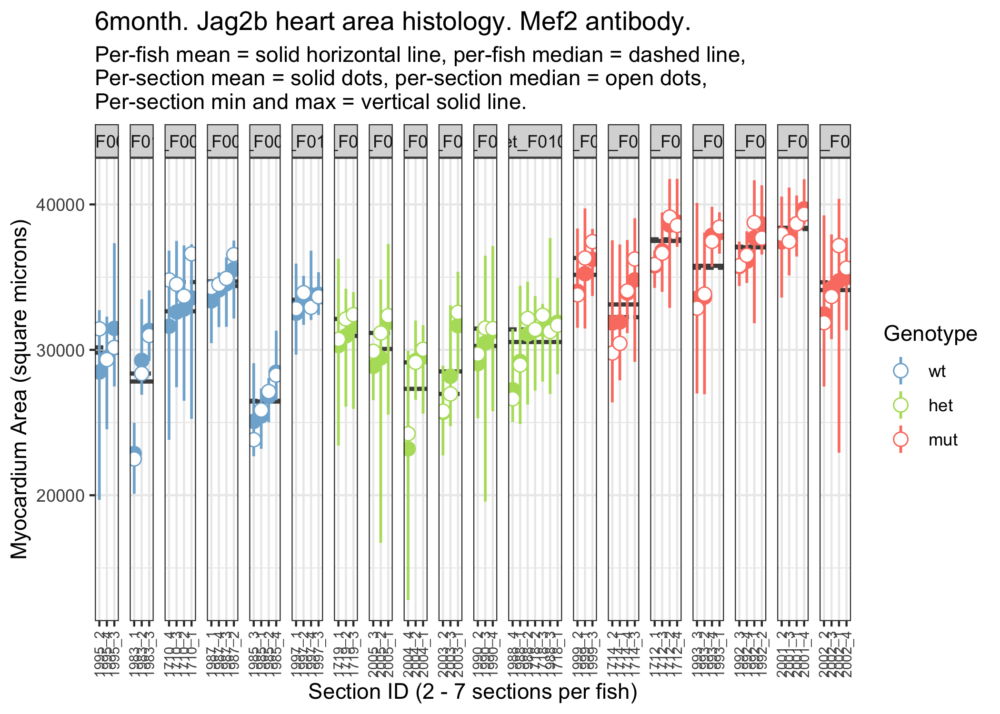

Jag2b Heart Density Imaging
================
Bradley Demarest
2022-12-19

``` r
# Load data for 4, 6, 8 month animals into separate data.tables.

#--------------
# 4-month data.
tab4 = readxl::read_excel("mef2_histology_analysis_jag2b_4_month_2022-12-11.xlsx")

tab4 = as.data.table(tab4)

# Remove rows where notes columns contains 'ripped do not use'.
tab4 = tab4[!notes %in% "ripped do not use"]

# Remove rows where fish_id is NA.
tab4 = tab4[!is.na(fish_id)]

#--------------
# 6-month data.
tab6 = readxl::read_excel("mef2_histology_analysis_jag2b_6_month_2022-12-20.xlsx")

tab6 = as.data.table(tab6)
# No 'ripped section' notes. No NA fish_ids.

#--------------
# 8-month data.
tab8 = readxl::read_excel("mef2_histology_analysis_jag2b_8_month_2022-12-20.xlsx")

tab8 = as.data.table(tab8)
# No 'ripped section' notes. No NA fish_ids.
```

Fish ids for 4-month histology data (dob:2021-08-19, n = 14 fish) are
not unique ids. (F16, F18, F19, F20, F21, F22, F23, F26, F27, F29, F3,
F30, F8, F9) (Fish ids F0001-F0024 are dob:2020-10-14, ultrasound data)
(Fish ids F0025-F0048 are dob:2021-08-19, ultrasound data)

``` r
# Combine data for 3 ages into one data.table.

tab4[, age:="4month"]
tab6[, age:="6month"]
tab8[, age:="8month"]

tab = rbind(tab4, tab6, tab8)
```

``` r
# Create unique measurement id column.
# Need to use: fish_id, file_id, section_id, measurement_id.

# 1. id2 column creates a unique identifier for each measurement.
#    Thus, the number of unique id2 values must equal the number of rows.
tab[, id2:=paste(fish_id, "_", file_id, "_S", 
                 section_id, "_M", measurement_id, 
                 sep="")]

stopifnot( length(unique(tab$id2)) == nrow(tab) )


length(unique(tab$id2))
```

    ## [1] 830

``` r
# [1] 830

dim(tab)
```

    ## [1] 830  16

``` r
# [1] 830  16

# Deal with duplicated measurement ids.
# tail(sort(table(tab$id2)))
#    F9_6495_S2_M3    F9_6495_S2_M4    F9_6495_S2_M5 F0078_1708_S1_M1 
#                1                1                1                2 
# F0114_1997_S2_M5 F0123_2002_S2_M5 
#                2                2
# 2022-12-19: Fixed 3 data entry errors by hand 
# (1 in 6month xlsx, 2 in 8month xlsx).


# Unique identifier for each section.
tab[, section_id2:=paste(file_id, section_id, sep="_")]
length(unique(tab$section_id2))
```

    ## [1] 166

``` r
# [1] 166
# There must be exactly 5 measurements for each section.
# Thus number of unique section ids must match number of rows.
# 166 * 5 = 830 

# Assess mis-match between section ids and measurement count.
dtab1 = tab[, list(measurement_count=.N), 
            by=list(fish_id, age, genotype, section_id2)]

dtab2 = tab[, list(measurement_count_per_section_id=.N),
            by=section_id2]

stopifnot(all(dtab2$count == 5))
stopifnot(nrow(dtab1) == nrow(dtab2))

# Assess whether file id is attached to more than 1 fish id.

# No test needed here. Inventory of files(slides) used per fish_id.
dtab3 = tab[, list(fileid_per_fishid=paste(sort(unique(file_id)),
                                               collapse=",")),
                   by=list(fish_id, age)]


# 2. Each file_id belongs to only one fish_id.
dtab4 = tab[, list(fishid_per_fileid=paste(sort(unique(fish_id)),
                                           collapse=","),
                   n_fishid_per_fileid=length(unique(fish_id))),
            by=file_id]
stopifnot(all(dtab4$n_fishid_per_fileid == 1))


# fish_id2 with age and genotype included.
tab[, fish_id2:=paste(genotype, fish_id, sep="_")]
```

``` r
# Manually create factor columns.

tab[, genotype2:=factor(genotype, levels=c("wt", "het", "mut"))]
```

``` r
# Number of sections per fish_id
xtab2 = tab[, .N, by=list(fish_id2, fish_id, age, genotype2, section_id2)]

xtab2 %>% as_tibble() %>%
  group_by(fish_id2) %>%
  gt()
```

<style>html {
  font-family: -apple-system, BlinkMacSystemFont, 'Segoe UI', Roboto, Oxygen, Ubuntu, Cantarell, 'Helvetica Neue', 'Fira Sans', 'Droid Sans', Arial, sans-serif;
}

#yriioasgtb .gt_table {
  display: table;
  border-collapse: collapse;
  margin-left: auto;
  /* table.margin.left */
  margin-right: auto;
  /* table.margin.right */
  color: #333333;
  font-size: 16px;
  /* table.font.size */
  background-color: #FFFFFF;
  /* table.background.color */
  width: auto;
  /* table.width */
  border-top-style: solid;
  /* table.border.top.style */
  border-top-width: 2px;
  /* table.border.top.width */
  border-top-color: #A8A8A8;
  /* table.border.top.color */
  border-bottom-style: solid;
  /* table.border.bottom.style */
  border-bottom-width: 2px;
  /* table.border.bottom.width */
  border-bottom-color: #A8A8A8;
  /* table.border.bottom.color */
}

#yriioasgtb .gt_heading {
  background-color: #FFFFFF;
  /* heading.background.color */
  border-bottom-color: #FFFFFF;
  /* table.background.color */
  border-left-style: hidden;
  /* heading.border.lr.style */
  border-left-width: 1px;
  /* heading.border.lr.width */
  border-left-color: #D3D3D3;
  /* heading.border.lr.color */
  border-right-style: hidden;
  /* heading.border.lr.style */
  border-right-width: 1px;
  /* heading.border.lr.width */
  border-right-color: #D3D3D3;
  /* heading.border.lr.color */
}

#yriioasgtb .gt_title {
  color: #333333;
  font-size: 125%;
  /* heading.title.font.size */
  font-weight: initial;
  /* heading.title.font.weight */
  padding-top: 4px;
  /* heading.top.padding - not yet used */
  padding-bottom: 4px;
  border-bottom-color: #FFFFFF;
  /* table.background.color */
  border-bottom-width: 0;
}

#yriioasgtb .gt_subtitle {
  color: #333333;
  font-size: 85%;
  /* heading.subtitle.font.size */
  font-weight: initial;
  /* heading.subtitle.font.weight */
  padding-top: 0;
  padding-bottom: 4px;
  /* heading.bottom.padding - not yet used */
  border-top-color: #FFFFFF;
  /* table.background.color */
  border-top-width: 0;
}

#yriioasgtb .gt_bottom_border {
  border-bottom-style: solid;
  /* heading.border.bottom.style */
  border-bottom-width: 2px;
  /* heading.border.bottom.width */
  border-bottom-color: #D3D3D3;
  /* heading.border.bottom.color */
}

#yriioasgtb .gt_column_spanner {
  border-bottom-style: solid;
  border-bottom-width: 2px;
  border-bottom-color: #D3D3D3;
  padding-top: 4px;
  padding-bottom: 4px;
}

#yriioasgtb .gt_col_headings {
  border-top-style: solid;
  /* column_labels.border.top.style */
  border-top-width: 2px;
  /* column_labels.border.top.width */
  border-top-color: #D3D3D3;
  /* column_labels.border.top.color */
  border-bottom-style: solid;
  /* column_labels.border.bottom.style */
  border-bottom-width: 2px;
  /* column_labels.border.bottom.width */
  border-bottom-color: #D3D3D3;
  /* column_labels.border.bottom.color */
  border-left-style: none;
  /* column_labels.border.lr.style */
  border-left-width: 1px;
  /* column_labels.border.lr.width */
  border-left-color: #D3D3D3;
  /* column_labels.border.lr.color */
  border-right-style: none;
  /* column_labels.border.lr.style */
  border-right-width: 1px;
  /* column_labels.border.lr.width */
  border-right-color: #D3D3D3;
  /* column_labels.border.lr.color */
}

#yriioasgtb .gt_col_heading {
  color: #333333;
  background-color: #FFFFFF;
  /* column_labels.background.color */
  font-size: 100%;
  /* column_labels.font.size */
  font-weight: normal;
  /* column_labels.font.weight */
  text-transform: inherit;
  /* column_labels.text_transform */
  vertical-align: middle;
  padding: 5px;
  margin: 10px;
  overflow-x: hidden;
}

#yriioasgtb .gt_sep_right {
  border-right: 5px solid #FFFFFF;
}

#yriioasgtb .gt_group_heading {
  padding: 8px;
  /* row_group.padding */
  color: #333333;
  background-color: #FFFFFF;
  /* row_group.background.color */
  font-size: 100%;
  /* row_group.font.size */
  font-weight: initial;
  /* row_group.font.weight */
  text-transform: inherit;
  /* row_group.text_transform */
  border-top-style: solid;
  /* row_group.border.top.style */
  border-top-width: 2px;
  /* row_group.border.top.width */
  border-top-color: #D3D3D3;
  /* row_group.border.top.color */
  border-bottom-style: solid;
  /* row_group.border.bottom.style */
  border-bottom-width: 2px;
  /* row_group.border.bottom.width */
  border-bottom-color: #D3D3D3;
  /* row_group.border.bottom.color */
  border-left-style: none;
  /* row_group.border.left.style */
  border-left-width: 1px;
  /* row_group.border.left.width */
  border-left-color: #D3D3D3;
  /* row_group.border.left.color */
  border-right-style: none;
  /* row_group.border.right.style */
  border-right-width: 1px;
  /* row_group.border.right.width */
  border-right-color: #D3D3D3;
  /* row_group.border.right.color */
  vertical-align: middle;
}

#yriioasgtb .gt_empty_group_heading {
  padding: 0.5px;
  color: #333333;
  background-color: #FFFFFF;
  /* row_group.background.color */
  font-size: 100%;
  /* row_group.font.size */
  font-weight: initial;
  /* row_group.font.weight */
  border-top-style: solid;
  /* row_group.border.top.style */
  border-top-width: 2px;
  /* row_group.border.top.width */
  border-top-color: #D3D3D3;
  /* row_group.border.top.color */
  border-bottom-style: solid;
  /* row_group.border.bottom.style */
  border-bottom-width: 2px;
  /* row_group.border.bottom.width */
  border-bottom-color: #D3D3D3;
  /* row_group.border.bottom.color */
  vertical-align: middle;
}

#yriioasgtb .gt_striped {
  background-color: rgba(128, 128, 128, 0.05);
  /* row.striping.background_color */
}

#yriioasgtb .gt_from_md > :first-child {
  margin-top: 0;
}

#yriioasgtb .gt_from_md > :last-child {
  margin-bottom: 0;
}

#yriioasgtb .gt_row {
  padding-top: 8px;
  /* data_row.padding */
  padding-bottom: 8px;
  /* data_row.padding */
  padding-left: 5px;
  padding-right: 5px;
  margin: 10px;
  border-top-style: solid;
  /* table_body.hlines.style */
  border-top-width: 1px;
  /* table_body.hlines.width */
  border-top-color: #D3D3D3;
  /* table_body.hlines.color */
  border-left-style: none;
  /* table_body.vlines.style */
  border-left-width: 1px;
  /* table_body.vlines.width */
  border-left-color: #D3D3D3;
  /* table_body.vlines.color */
  border-right-style: none;
  /* table_body.vlines.style */
  border-right-width: 1px;
  /* table_body.vlines.width */
  border-right-color: #D3D3D3;
  /* table_body.vlines.color */
  vertical-align: middle;
  overflow-x: hidden;
}

#yriioasgtb .gt_stub {
  color: #333333;
  background-color: #FFFFFF;
  /* stub.background.color */
  font-weight: initial;
  /* stub.font.weight */
  text-transform: inherit;
  /* stub.text_transform */
  border-right-style: solid;
  /* stub.border.style */
  border-right-width: 2px;
  /* stub.border.width */
  border-right-color: #D3D3D3;
  /* stub.border.color */
  padding-left: 12px;
}

#yriioasgtb .gt_summary_row {
  color: #333333;
  background-color: #FFFFFF;
  /* summary_row.background.color */
  text-transform: inherit;
  /* summary_row.text_transform */
  padding-top: 8px;
  /* summary_row.padding */
  padding-bottom: 8px;
  /* summary_row.padding */
  padding-left: 5px;
  padding-right: 5px;
}

#yriioasgtb .gt_first_summary_row {
  padding-top: 8px;
  /* summary_row.padding */
  padding-bottom: 8px;
  /* summary_row.padding */
  padding-left: 5px;
  padding-right: 5px;
  border-top-style: solid;
  /* summary_row.border.style */
  border-top-width: 2px;
  /* summary_row.border.width */
  border-top-color: #D3D3D3;
  /* summary_row.border.color */
}

#yriioasgtb .gt_grand_summary_row {
  color: #333333;
  background-color: #FFFFFF;
  /* grand_summary_row.background.color */
  text-transform: inherit;
  /* grand_summary_row.text_transform */
  padding-top: 8px;
  /* grand_summary_row.padding */
  padding-bottom: 8px;
  /* grand_summary_row.padding */
  padding-left: 5px;
  padding-right: 5px;
}

#yriioasgtb .gt_first_grand_summary_row {
  padding-top: 8px;
  /* grand_summary_row.padding */
  padding-bottom: 8px;
  /* grand_summary_row.padding */
  padding-left: 5px;
  padding-right: 5px;
  border-top-style: double;
  /* grand_summary_row.border.style */
  border-top-width: 6px;
  /* grand_summary_row.border.width */
  border-top-color: #D3D3D3;
  /* grand_summary_row.border.color */
}

#yriioasgtb .gt_table_body {
  border-top-style: solid;
  /* table_body.border.top.style */
  border-top-width: 2px;
  /* table_body.border.top.width */
  border-top-color: #D3D3D3;
  /* table_body.border.top.color */
  border-bottom-style: solid;
  /* table_body.border.bottom.style */
  border-bottom-width: 2px;
  /* table_body.border.bottom.width */
  border-bottom-color: #D3D3D3;
  /* table_body.border.bottom.color */
}

#yriioasgtb .gt_footnotes {
  color: #333333;
  background-color: #FFFFFF;
  /* footnotes.background.color */
  border-bottom-style: none;
  /* footnotes.border.bottom.style */
  border-bottom-width: 2px;
  /* footnotes.border.bottom.width */
  border-bottom-color: #D3D3D3;
  /* footnotes.border.bottom.color */
  border-left-style: none;
  /* footnotes.border.lr.color */
  border-left-width: 2px;
  /* footnotes.border.lr.color */
  border-left-color: #D3D3D3;
  /* footnotes.border.lr.color */
  border-right-style: none;
  /* footnotes.border.lr.color */
  border-right-width: 2px;
  /* footnotes.border.lr.color */
  border-right-color: #D3D3D3;
  /* footnotes.border.lr.color */
}

#yriioasgtb .gt_footnote {
  margin: 0px;
  font-size: 90%;
  /* footnotes.font.size */
  padding: 4px;
  /* footnotes.padding */
}

#yriioasgtb .gt_sourcenotes {
  color: #333333;
  background-color: #FFFFFF;
  /* source_notes.background.color */
  border-bottom-style: none;
  /* source_notes.border.bottom.style */
  border-bottom-width: 2px;
  /* source_notes.border.bottom.width */
  border-bottom-color: #D3D3D3;
  /* source_notes.border.bottom.color */
  border-left-style: none;
  /* source_notes.border.lr.style */
  border-left-width: 2px;
  /* source_notes.border.lr.style */
  border-left-color: #D3D3D3;
  /* source_notes.border.lr.style */
  border-right-style: none;
  /* source_notes.border.lr.style */
  border-right-width: 2px;
  /* source_notes.border.lr.style */
  border-right-color: #D3D3D3;
  /* source_notes.border.lr.style */
}

#yriioasgtb .gt_sourcenote {
  font-size: 90%;
  /* source_notes.font.size */
  padding: 4px;
  /* source_notes.padding */
}

#yriioasgtb .gt_left {
  text-align: left;
}

#yriioasgtb .gt_center {
  text-align: center;
}

#yriioasgtb .gt_right {
  text-align: right;
  font-variant-numeric: tabular-nums;
}

#yriioasgtb .gt_font_normal {
  font-weight: normal;
}

#yriioasgtb .gt_font_bold {
  font-weight: bold;
}

#yriioasgtb .gt_font_italic {
  font-style: italic;
}

#yriioasgtb .gt_super {
  font-size: 65%;
}

#yriioasgtb .gt_footnote_marks {
  font-style: italic;
  font-size: 65%;
}
</style>
<div id="yriioasgtb" style="overflow-x:auto;overflow-y:auto;width:auto;height:auto;"><table class="gt_table">
  
  <thead class="gt_col_headings">
    <tr>
      <th class="gt_col_heading gt_columns_bottom_border gt_left" rowspan="1" colspan="1">fish_id</th>
      <th class="gt_col_heading gt_columns_bottom_border gt_left" rowspan="1" colspan="1">age</th>
      <th class="gt_col_heading gt_columns_bottom_border gt_center" rowspan="1" colspan="1">genotype2</th>
      <th class="gt_col_heading gt_columns_bottom_border gt_left" rowspan="1" colspan="1">section_id2</th>
      <th class="gt_col_heading gt_columns_bottom_border gt_center" rowspan="1" colspan="1">N</th>
    </tr>
  </thead>
  <tbody class="gt_table_body">
    <tr class="gt_group_heading_row">
      <td colspan="5" class="gt_group_heading">het_F30</td>
    </tr>
    <tr>
      <td class="gt_row gt_left">F30</td>
      <td class="gt_row gt_left">4month</td>
      <td class="gt_row gt_center">het</td>
      <td class="gt_row gt_left">6478_1</td>
      <td class="gt_row gt_center">5</td>
    </tr>
    <tr>
      <td class="gt_row gt_left gt_striped">F30</td>
      <td class="gt_row gt_left gt_striped">4month</td>
      <td class="gt_row gt_center gt_striped">het</td>
      <td class="gt_row gt_left gt_striped">6478_2</td>
      <td class="gt_row gt_center gt_striped">5</td>
    </tr>
    <tr>
      <td class="gt_row gt_left">F30</td>
      <td class="gt_row gt_left">4month</td>
      <td class="gt_row gt_center">het</td>
      <td class="gt_row gt_left">6478_3</td>
      <td class="gt_row gt_center">5</td>
    </tr>
    <tr>
      <td class="gt_row gt_left gt_striped">F30</td>
      <td class="gt_row gt_left gt_striped">4month</td>
      <td class="gt_row gt_center gt_striped">het</td>
      <td class="gt_row gt_left gt_striped">6478_4</td>
      <td class="gt_row gt_center gt_striped">5</td>
    </tr>
    <tr>
      <td class="gt_row gt_left">F30</td>
      <td class="gt_row gt_left">4month</td>
      <td class="gt_row gt_center">het</td>
      <td class="gt_row gt_left">6478_5</td>
      <td class="gt_row gt_center">5</td>
    </tr>
    <tr class="gt_group_heading_row">
      <td colspan="5" class="gt_group_heading">het_F29</td>
    </tr>
    <tr>
      <td class="gt_row gt_left gt_striped">F29</td>
      <td class="gt_row gt_left gt_striped">4month</td>
      <td class="gt_row gt_center gt_striped">het</td>
      <td class="gt_row gt_left gt_striped">6479_1</td>
      <td class="gt_row gt_center gt_striped">5</td>
    </tr>
    <tr>
      <td class="gt_row gt_left">F29</td>
      <td class="gt_row gt_left">4month</td>
      <td class="gt_row gt_center">het</td>
      <td class="gt_row gt_left">6479_2</td>
      <td class="gt_row gt_center">5</td>
    </tr>
    <tr>
      <td class="gt_row gt_left gt_striped">F29</td>
      <td class="gt_row gt_left gt_striped">4month</td>
      <td class="gt_row gt_center gt_striped">het</td>
      <td class="gt_row gt_left gt_striped">6479_3</td>
      <td class="gt_row gt_center gt_striped">5</td>
    </tr>
    <tr>
      <td class="gt_row gt_left">F29</td>
      <td class="gt_row gt_left">4month</td>
      <td class="gt_row gt_center">het</td>
      <td class="gt_row gt_left">6479_4</td>
      <td class="gt_row gt_center">5</td>
    </tr>
    <tr>
      <td class="gt_row gt_left gt_striped">F29</td>
      <td class="gt_row gt_left gt_striped">4month</td>
      <td class="gt_row gt_center gt_striped">het</td>
      <td class="gt_row gt_left gt_striped">6491_1</td>
      <td class="gt_row gt_center gt_striped">5</td>
    </tr>
    <tr>
      <td class="gt_row gt_left">F29</td>
      <td class="gt_row gt_left">4month</td>
      <td class="gt_row gt_center">het</td>
      <td class="gt_row gt_left">6491_2</td>
      <td class="gt_row gt_center">5</td>
    </tr>
    <tr>
      <td class="gt_row gt_left gt_striped">F29</td>
      <td class="gt_row gt_left gt_striped">4month</td>
      <td class="gt_row gt_center gt_striped">het</td>
      <td class="gt_row gt_left gt_striped">6491_3</td>
      <td class="gt_row gt_center gt_striped">5</td>
    </tr>
    <tr>
      <td class="gt_row gt_left">F29</td>
      <td class="gt_row gt_left">4month</td>
      <td class="gt_row gt_center">het</td>
      <td class="gt_row gt_left">6491_4</td>
      <td class="gt_row gt_center">5</td>
    </tr>
    <tr class="gt_group_heading_row">
      <td colspan="5" class="gt_group_heading">het_F27</td>
    </tr>
    <tr>
      <td class="gt_row gt_left gt_striped">F27</td>
      <td class="gt_row gt_left gt_striped">4month</td>
      <td class="gt_row gt_center gt_striped">het</td>
      <td class="gt_row gt_left gt_striped">6490_1</td>
      <td class="gt_row gt_center gt_striped">5</td>
    </tr>
    <tr>
      <td class="gt_row gt_left">F27</td>
      <td class="gt_row gt_left">4month</td>
      <td class="gt_row gt_center">het</td>
      <td class="gt_row gt_left">6490_2</td>
      <td class="gt_row gt_center">5</td>
    </tr>
    <tr>
      <td class="gt_row gt_left gt_striped">F27</td>
      <td class="gt_row gt_left gt_striped">4month</td>
      <td class="gt_row gt_center gt_striped">het</td>
      <td class="gt_row gt_left gt_striped">6490_3</td>
      <td class="gt_row gt_center gt_striped">5</td>
    </tr>
    <tr>
      <td class="gt_row gt_left">F27</td>
      <td class="gt_row gt_left">4month</td>
      <td class="gt_row gt_center">het</td>
      <td class="gt_row gt_left">6490_4</td>
      <td class="gt_row gt_center">5</td>
    </tr>
    <tr class="gt_group_heading_row">
      <td colspan="5" class="gt_group_heading">mut_F9</td>
    </tr>
    <tr>
      <td class="gt_row gt_left gt_striped">F9</td>
      <td class="gt_row gt_left gt_striped">4month</td>
      <td class="gt_row gt_center gt_striped">mut</td>
      <td class="gt_row gt_left gt_striped">6482_1</td>
      <td class="gt_row gt_center gt_striped">5</td>
    </tr>
    <tr>
      <td class="gt_row gt_left">F9</td>
      <td class="gt_row gt_left">4month</td>
      <td class="gt_row gt_center">mut</td>
      <td class="gt_row gt_left">6482_3</td>
      <td class="gt_row gt_center">5</td>
    </tr>
    <tr>
      <td class="gt_row gt_left gt_striped">F9</td>
      <td class="gt_row gt_left gt_striped">4month</td>
      <td class="gt_row gt_center gt_striped">mut</td>
      <td class="gt_row gt_left gt_striped">6482_4</td>
      <td class="gt_row gt_center gt_striped">5</td>
    </tr>
    <tr>
      <td class="gt_row gt_left">F9</td>
      <td class="gt_row gt_left">4month</td>
      <td class="gt_row gt_center">mut</td>
      <td class="gt_row gt_left">6495_1</td>
      <td class="gt_row gt_center">5</td>
    </tr>
    <tr>
      <td class="gt_row gt_left gt_striped">F9</td>
      <td class="gt_row gt_left gt_striped">4month</td>
      <td class="gt_row gt_center gt_striped">mut</td>
      <td class="gt_row gt_left gt_striped">6495_2</td>
      <td class="gt_row gt_center gt_striped">5</td>
    </tr>
    <tr class="gt_group_heading_row">
      <td colspan="5" class="gt_group_heading">mut_F20</td>
    </tr>
    <tr>
      <td class="gt_row gt_left">F20</td>
      <td class="gt_row gt_left">4month</td>
      <td class="gt_row gt_center">mut</td>
      <td class="gt_row gt_left">6483_1</td>
      <td class="gt_row gt_center">5</td>
    </tr>
    <tr>
      <td class="gt_row gt_left gt_striped">F20</td>
      <td class="gt_row gt_left gt_striped">4month</td>
      <td class="gt_row gt_center gt_striped">mut</td>
      <td class="gt_row gt_left gt_striped">6483_2</td>
      <td class="gt_row gt_center gt_striped">5</td>
    </tr>
    <tr>
      <td class="gt_row gt_left">F20</td>
      <td class="gt_row gt_left">4month</td>
      <td class="gt_row gt_center">mut</td>
      <td class="gt_row gt_left">6483_4</td>
      <td class="gt_row gt_center">5</td>
    </tr>
    <tr class="gt_group_heading_row">
      <td colspan="5" class="gt_group_heading">mut_F18</td>
    </tr>
    <tr>
      <td class="gt_row gt_left gt_striped">F18</td>
      <td class="gt_row gt_left gt_striped">4month</td>
      <td class="gt_row gt_center gt_striped">mut</td>
      <td class="gt_row gt_left gt_striped">6484_1</td>
      <td class="gt_row gt_center gt_striped">5</td>
    </tr>
    <tr>
      <td class="gt_row gt_left">F18</td>
      <td class="gt_row gt_left">4month</td>
      <td class="gt_row gt_center">mut</td>
      <td class="gt_row gt_left">6484_2</td>
      <td class="gt_row gt_center">5</td>
    </tr>
    <tr>
      <td class="gt_row gt_left gt_striped">F18</td>
      <td class="gt_row gt_left gt_striped">4month</td>
      <td class="gt_row gt_center gt_striped">mut</td>
      <td class="gt_row gt_left gt_striped">6484_3</td>
      <td class="gt_row gt_center gt_striped">5</td>
    </tr>
    <tr>
      <td class="gt_row gt_left">F18</td>
      <td class="gt_row gt_left">4month</td>
      <td class="gt_row gt_center">mut</td>
      <td class="gt_row gt_left">6484_4</td>
      <td class="gt_row gt_center">5</td>
    </tr>
    <tr>
      <td class="gt_row gt_left gt_striped">F18</td>
      <td class="gt_row gt_left gt_striped">4month</td>
      <td class="gt_row gt_center gt_striped">mut</td>
      <td class="gt_row gt_left gt_striped">6496_1</td>
      <td class="gt_row gt_center gt_striped">5</td>
    </tr>
    <tr>
      <td class="gt_row gt_left">F18</td>
      <td class="gt_row gt_left">4month</td>
      <td class="gt_row gt_center">mut</td>
      <td class="gt_row gt_left">6496_2</td>
      <td class="gt_row gt_center">5</td>
    </tr>
    <tr>
      <td class="gt_row gt_left gt_striped">F18</td>
      <td class="gt_row gt_left gt_striped">4month</td>
      <td class="gt_row gt_center gt_striped">mut</td>
      <td class="gt_row gt_left gt_striped">6496_3</td>
      <td class="gt_row gt_center gt_striped">5</td>
    </tr>
    <tr class="gt_group_heading_row">
      <td colspan="5" class="gt_group_heading">mut_F19</td>
    </tr>
    <tr>
      <td class="gt_row gt_left">F19</td>
      <td class="gt_row gt_left">4month</td>
      <td class="gt_row gt_center">mut</td>
      <td class="gt_row gt_left">6485_1</td>
      <td class="gt_row gt_center">5</td>
    </tr>
    <tr>
      <td class="gt_row gt_left gt_striped">F19</td>
      <td class="gt_row gt_left gt_striped">4month</td>
      <td class="gt_row gt_center gt_striped">mut</td>
      <td class="gt_row gt_left gt_striped">6485_2</td>
      <td class="gt_row gt_center gt_striped">5</td>
    </tr>
    <tr>
      <td class="gt_row gt_left">F19</td>
      <td class="gt_row gt_left">4month</td>
      <td class="gt_row gt_center">mut</td>
      <td class="gt_row gt_left">6485_4</td>
      <td class="gt_row gt_center">5</td>
    </tr>
    <tr class="gt_group_heading_row">
      <td colspan="5" class="gt_group_heading">mut_F8</td>
    </tr>
    <tr>
      <td class="gt_row gt_left gt_striped">F8</td>
      <td class="gt_row gt_left gt_striped">4month</td>
      <td class="gt_row gt_center gt_striped">mut</td>
      <td class="gt_row gt_left gt_striped">6494_1</td>
      <td class="gt_row gt_center gt_striped">5</td>
    </tr>
    <tr>
      <td class="gt_row gt_left">F8</td>
      <td class="gt_row gt_left">4month</td>
      <td class="gt_row gt_center">mut</td>
      <td class="gt_row gt_left">6494_2</td>
      <td class="gt_row gt_center">5</td>
    </tr>
    <tr>
      <td class="gt_row gt_left gt_striped">F8</td>
      <td class="gt_row gt_left gt_striped">4month</td>
      <td class="gt_row gt_center gt_striped">mut</td>
      <td class="gt_row gt_left gt_striped">6494_3</td>
      <td class="gt_row gt_center gt_striped">5</td>
    </tr>
    <tr class="gt_group_heading_row">
      <td colspan="5" class="gt_group_heading">wt_F26</td>
    </tr>
    <tr>
      <td class="gt_row gt_left">F26</td>
      <td class="gt_row gt_left">4month</td>
      <td class="gt_row gt_center">wt</td>
      <td class="gt_row gt_left">6486_2</td>
      <td class="gt_row gt_center">5</td>
    </tr>
    <tr>
      <td class="gt_row gt_left gt_striped">F26</td>
      <td class="gt_row gt_left gt_striped">4month</td>
      <td class="gt_row gt_center gt_striped">wt</td>
      <td class="gt_row gt_left gt_striped">6486_3</td>
      <td class="gt_row gt_center gt_striped">5</td>
    </tr>
    <tr>
      <td class="gt_row gt_left">F26</td>
      <td class="gt_row gt_left">4month</td>
      <td class="gt_row gt_center">wt</td>
      <td class="gt_row gt_left">6486_4</td>
      <td class="gt_row gt_center">5</td>
    </tr>
    <tr class="gt_group_heading_row">
      <td colspan="5" class="gt_group_heading">wt_F21</td>
    </tr>
    <tr>
      <td class="gt_row gt_left gt_striped">F21</td>
      <td class="gt_row gt_left gt_striped">4month</td>
      <td class="gt_row gt_center gt_striped">wt</td>
      <td class="gt_row gt_left gt_striped">6487_1</td>
      <td class="gt_row gt_center gt_striped">5</td>
    </tr>
    <tr>
      <td class="gt_row gt_left">F21</td>
      <td class="gt_row gt_left">4month</td>
      <td class="gt_row gt_center">wt</td>
      <td class="gt_row gt_left">6487_2</td>
      <td class="gt_row gt_center">5</td>
    </tr>
    <tr>
      <td class="gt_row gt_left gt_striped">F21</td>
      <td class="gt_row gt_left gt_striped">4month</td>
      <td class="gt_row gt_center gt_striped">wt</td>
      <td class="gt_row gt_left gt_striped">6487_3</td>
      <td class="gt_row gt_center gt_striped">5</td>
    </tr>
    <tr>
      <td class="gt_row gt_left">F21</td>
      <td class="gt_row gt_left">4month</td>
      <td class="gt_row gt_center">wt</td>
      <td class="gt_row gt_left">6487_4</td>
      <td class="gt_row gt_center">5</td>
    </tr>
    <tr>
      <td class="gt_row gt_left gt_striped">F21</td>
      <td class="gt_row gt_left gt_striped">4month</td>
      <td class="gt_row gt_center gt_striped">wt</td>
      <td class="gt_row gt_left gt_striped">6498_1</td>
      <td class="gt_row gt_center gt_striped">5</td>
    </tr>
    <tr>
      <td class="gt_row gt_left">F21</td>
      <td class="gt_row gt_left">4month</td>
      <td class="gt_row gt_center">wt</td>
      <td class="gt_row gt_left">6498_2</td>
      <td class="gt_row gt_center">5</td>
    </tr>
    <tr>
      <td class="gt_row gt_left gt_striped">F21</td>
      <td class="gt_row gt_left gt_striped">4month</td>
      <td class="gt_row gt_center gt_striped">wt</td>
      <td class="gt_row gt_left gt_striped">6498_3</td>
      <td class="gt_row gt_center gt_striped">5</td>
    </tr>
    <tr class="gt_group_heading_row">
      <td colspan="5" class="gt_group_heading">wt_F23</td>
    </tr>
    <tr>
      <td class="gt_row gt_left">F23</td>
      <td class="gt_row gt_left">4month</td>
      <td class="gt_row gt_center">wt</td>
      <td class="gt_row gt_left">6489_1</td>
      <td class="gt_row gt_center">5</td>
    </tr>
    <tr>
      <td class="gt_row gt_left gt_striped">F23</td>
      <td class="gt_row gt_left gt_striped">4month</td>
      <td class="gt_row gt_center gt_striped">wt</td>
      <td class="gt_row gt_left gt_striped">6489_2</td>
      <td class="gt_row gt_center gt_striped">5</td>
    </tr>
    <tr>
      <td class="gt_row gt_left">F23</td>
      <td class="gt_row gt_left">4month</td>
      <td class="gt_row gt_center">wt</td>
      <td class="gt_row gt_left">6489_3</td>
      <td class="gt_row gt_center">5</td>
    </tr>
    <tr>
      <td class="gt_row gt_left gt_striped">F23</td>
      <td class="gt_row gt_left gt_striped">4month</td>
      <td class="gt_row gt_center gt_striped">wt</td>
      <td class="gt_row gt_left gt_striped">6489_4</td>
      <td class="gt_row gt_center gt_striped">5</td>
    </tr>
    <tr>
      <td class="gt_row gt_left">F23</td>
      <td class="gt_row gt_left">4month</td>
      <td class="gt_row gt_center">wt</td>
      <td class="gt_row gt_left">6501_1</td>
      <td class="gt_row gt_center">5</td>
    </tr>
    <tr>
      <td class="gt_row gt_left gt_striped">F23</td>
      <td class="gt_row gt_left gt_striped">4month</td>
      <td class="gt_row gt_center gt_striped">wt</td>
      <td class="gt_row gt_left gt_striped">6501_3</td>
      <td class="gt_row gt_center gt_striped">5</td>
    </tr>
    <tr>
      <td class="gt_row gt_left">F23</td>
      <td class="gt_row gt_left">4month</td>
      <td class="gt_row gt_center">wt</td>
      <td class="gt_row gt_left">6501_4</td>
      <td class="gt_row gt_center">5</td>
    </tr>
    <tr class="gt_group_heading_row">
      <td colspan="5" class="gt_group_heading">het_F16</td>
    </tr>
    <tr>
      <td class="gt_row gt_left gt_striped">F16</td>
      <td class="gt_row gt_left gt_striped">4month</td>
      <td class="gt_row gt_center gt_striped">het</td>
      <td class="gt_row gt_left gt_striped">6481_1</td>
      <td class="gt_row gt_center gt_striped">5</td>
    </tr>
    <tr>
      <td class="gt_row gt_left">F16</td>
      <td class="gt_row gt_left">4month</td>
      <td class="gt_row gt_center">het</td>
      <td class="gt_row gt_left">6481_2</td>
      <td class="gt_row gt_center">5</td>
    </tr>
    <tr>
      <td class="gt_row gt_left gt_striped">F16</td>
      <td class="gt_row gt_left gt_striped">4month</td>
      <td class="gt_row gt_center gt_striped">het</td>
      <td class="gt_row gt_left gt_striped">6481_3</td>
      <td class="gt_row gt_center gt_striped">5</td>
    </tr>
    <tr>
      <td class="gt_row gt_left">F16</td>
      <td class="gt_row gt_left">4month</td>
      <td class="gt_row gt_center">het</td>
      <td class="gt_row gt_left">6481_4</td>
      <td class="gt_row gt_center">5</td>
    </tr>
    <tr>
      <td class="gt_row gt_left gt_striped">F16</td>
      <td class="gt_row gt_left gt_striped">4month</td>
      <td class="gt_row gt_center gt_striped">het</td>
      <td class="gt_row gt_left gt_striped">6492_1</td>
      <td class="gt_row gt_center gt_striped">5</td>
    </tr>
    <tr>
      <td class="gt_row gt_left">F16</td>
      <td class="gt_row gt_left">4month</td>
      <td class="gt_row gt_center">het</td>
      <td class="gt_row gt_left">6492_2</td>
      <td class="gt_row gt_center">5</td>
    </tr>
    <tr>
      <td class="gt_row gt_left gt_striped">F16</td>
      <td class="gt_row gt_left gt_striped">4month</td>
      <td class="gt_row gt_center gt_striped">het</td>
      <td class="gt_row gt_left gt_striped">6492_3</td>
      <td class="gt_row gt_center gt_striped">5</td>
    </tr>
    <tr class="gt_group_heading_row">
      <td colspan="5" class="gt_group_heading">wt_F3</td>
    </tr>
    <tr>
      <td class="gt_row gt_left">F3</td>
      <td class="gt_row gt_left">4month</td>
      <td class="gt_row gt_center">wt</td>
      <td class="gt_row gt_left">6500_1</td>
      <td class="gt_row gt_center">5</td>
    </tr>
    <tr>
      <td class="gt_row gt_left gt_striped">F3</td>
      <td class="gt_row gt_left gt_striped">4month</td>
      <td class="gt_row gt_center gt_striped">wt</td>
      <td class="gt_row gt_left gt_striped">6500_2</td>
      <td class="gt_row gt_center gt_striped">5</td>
    </tr>
    <tr class="gt_group_heading_row">
      <td colspan="5" class="gt_group_heading">wt_F22</td>
    </tr>
    <tr>
      <td class="gt_row gt_left">F22</td>
      <td class="gt_row gt_left">4month</td>
      <td class="gt_row gt_center">wt</td>
      <td class="gt_row gt_left">6499_1</td>
      <td class="gt_row gt_center">5</td>
    </tr>
    <tr>
      <td class="gt_row gt_left gt_striped">F22</td>
      <td class="gt_row gt_left gt_striped">4month</td>
      <td class="gt_row gt_center gt_striped">wt</td>
      <td class="gt_row gt_left gt_striped">6499_2</td>
      <td class="gt_row gt_center gt_striped">5</td>
    </tr>
    <tr>
      <td class="gt_row gt_left">F22</td>
      <td class="gt_row gt_left">4month</td>
      <td class="gt_row gt_center">wt</td>
      <td class="gt_row gt_left">6499_3</td>
      <td class="gt_row gt_center">5</td>
    </tr>
    <tr>
      <td class="gt_row gt_left gt_striped">F22</td>
      <td class="gt_row gt_left gt_striped">4month</td>
      <td class="gt_row gt_center gt_striped">wt</td>
      <td class="gt_row gt_left gt_striped">6499_4</td>
      <td class="gt_row gt_center gt_striped">5</td>
    </tr>
    <tr>
      <td class="gt_row gt_left">F22</td>
      <td class="gt_row gt_left">4month</td>
      <td class="gt_row gt_center">wt</td>
      <td class="gt_row gt_left">6488_1</td>
      <td class="gt_row gt_center">5</td>
    </tr>
    <tr>
      <td class="gt_row gt_left gt_striped">F22</td>
      <td class="gt_row gt_left gt_striped">4month</td>
      <td class="gt_row gt_center gt_striped">wt</td>
      <td class="gt_row gt_left gt_striped">6488_2</td>
      <td class="gt_row gt_center gt_striped">5</td>
    </tr>
    <tr>
      <td class="gt_row gt_left">F22</td>
      <td class="gt_row gt_left">4month</td>
      <td class="gt_row gt_center">wt</td>
      <td class="gt_row gt_left">6488_3</td>
      <td class="gt_row gt_center">5</td>
    </tr>
    <tr>
      <td class="gt_row gt_left gt_striped">F22</td>
      <td class="gt_row gt_left gt_striped">4month</td>
      <td class="gt_row gt_center gt_striped">wt</td>
      <td class="gt_row gt_left gt_striped">6488_4</td>
      <td class="gt_row gt_center gt_striped">5</td>
    </tr>
    <tr class="gt_group_heading_row">
      <td colspan="5" class="gt_group_heading">het_F0079</td>
    </tr>
    <tr>
      <td class="gt_row gt_left">F0079</td>
      <td class="gt_row gt_left">6month</td>
      <td class="gt_row gt_center">het</td>
      <td class="gt_row gt_left">1717_1</td>
      <td class="gt_row gt_center">5</td>
    </tr>
    <tr>
      <td class="gt_row gt_left gt_striped">F0079</td>
      <td class="gt_row gt_left gt_striped">6month</td>
      <td class="gt_row gt_center gt_striped">het</td>
      <td class="gt_row gt_left gt_striped">1717_2</td>
      <td class="gt_row gt_center gt_striped">5</td>
    </tr>
    <tr>
      <td class="gt_row gt_left">F0079</td>
      <td class="gt_row gt_left">6month</td>
      <td class="gt_row gt_center">het</td>
      <td class="gt_row gt_left">1717_3</td>
      <td class="gt_row gt_center">5</td>
    </tr>
    <tr>
      <td class="gt_row gt_left gt_striped">F0079</td>
      <td class="gt_row gt_left gt_striped">6month</td>
      <td class="gt_row gt_center gt_striped">het</td>
      <td class="gt_row gt_left gt_striped">2006_1</td>
      <td class="gt_row gt_center gt_striped">5</td>
    </tr>
    <tr>
      <td class="gt_row gt_left">F0079</td>
      <td class="gt_row gt_left">6month</td>
      <td class="gt_row gt_center">het</td>
      <td class="gt_row gt_left">2006_2</td>
      <td class="gt_row gt_center">5</td>
    </tr>
    <tr>
      <td class="gt_row gt_left gt_striped">F0079</td>
      <td class="gt_row gt_left gt_striped">6month</td>
      <td class="gt_row gt_center gt_striped">het</td>
      <td class="gt_row gt_left gt_striped">2006_3</td>
      <td class="gt_row gt_center gt_striped">5</td>
    </tr>
    <tr>
      <td class="gt_row gt_left">F0079</td>
      <td class="gt_row gt_left">6month</td>
      <td class="gt_row gt_center">het</td>
      <td class="gt_row gt_left">2006_4</td>
      <td class="gt_row gt_center">5</td>
    </tr>
    <tr class="gt_group_heading_row">
      <td colspan="5" class="gt_group_heading">het_F0098</td>
    </tr>
    <tr>
      <td class="gt_row gt_left gt_striped">F0098</td>
      <td class="gt_row gt_left gt_striped">6month</td>
      <td class="gt_row gt_center gt_striped">het</td>
      <td class="gt_row gt_left gt_striped">1719_1</td>
      <td class="gt_row gt_center gt_striped">5</td>
    </tr>
    <tr>
      <td class="gt_row gt_left">F0098</td>
      <td class="gt_row gt_left">6month</td>
      <td class="gt_row gt_center">het</td>
      <td class="gt_row gt_left">1719_2</td>
      <td class="gt_row gt_center">5</td>
    </tr>
    <tr>
      <td class="gt_row gt_left gt_striped">F0098</td>
      <td class="gt_row gt_left gt_striped">6month</td>
      <td class="gt_row gt_center gt_striped">het</td>
      <td class="gt_row gt_left gt_striped">1719_3</td>
      <td class="gt_row gt_center gt_striped">5</td>
    </tr>
    <tr class="gt_group_heading_row">
      <td colspan="5" class="gt_group_heading">het_F0101</td>
    </tr>
    <tr>
      <td class="gt_row gt_left">F0101</td>
      <td class="gt_row gt_left">6month</td>
      <td class="gt_row gt_center">het</td>
      <td class="gt_row gt_left">1718_1</td>
      <td class="gt_row gt_center">5</td>
    </tr>
    <tr>
      <td class="gt_row gt_left gt_striped">F0101</td>
      <td class="gt_row gt_left gt_striped">6month</td>
      <td class="gt_row gt_center gt_striped">het</td>
      <td class="gt_row gt_left gt_striped">1718_2</td>
      <td class="gt_row gt_center gt_striped">5</td>
    </tr>
    <tr>
      <td class="gt_row gt_left">F0101</td>
      <td class="gt_row gt_left">6month</td>
      <td class="gt_row gt_center">het</td>
      <td class="gt_row gt_left">1718_3</td>
      <td class="gt_row gt_center">5</td>
    </tr>
    <tr>
      <td class="gt_row gt_left gt_striped">F0101</td>
      <td class="gt_row gt_left gt_striped">6month</td>
      <td class="gt_row gt_center gt_striped">het</td>
      <td class="gt_row gt_left gt_striped">1988_1</td>
      <td class="gt_row gt_center gt_striped">5</td>
    </tr>
    <tr>
      <td class="gt_row gt_left">F0101</td>
      <td class="gt_row gt_left">6month</td>
      <td class="gt_row gt_center">het</td>
      <td class="gt_row gt_left">1988_2</td>
      <td class="gt_row gt_center">5</td>
    </tr>
    <tr>
      <td class="gt_row gt_left gt_striped">F0101</td>
      <td class="gt_row gt_left gt_striped">6month</td>
      <td class="gt_row gt_center gt_striped">het</td>
      <td class="gt_row gt_left gt_striped">1988_3</td>
      <td class="gt_row gt_center gt_striped">5</td>
    </tr>
    <tr>
      <td class="gt_row gt_left">F0101</td>
      <td class="gt_row gt_left">6month</td>
      <td class="gt_row gt_center">het</td>
      <td class="gt_row gt_left">1988_4</td>
      <td class="gt_row gt_center">5</td>
    </tr>
    <tr class="gt_group_heading_row">
      <td colspan="5" class="gt_group_heading">mut_F0086</td>
    </tr>
    <tr>
      <td class="gt_row gt_left gt_striped">F0086</td>
      <td class="gt_row gt_left gt_striped">6month</td>
      <td class="gt_row gt_center gt_striped">mut</td>
      <td class="gt_row gt_left gt_striped">1715_1</td>
      <td class="gt_row gt_center gt_striped">5</td>
    </tr>
    <tr>
      <td class="gt_row gt_left">F0086</td>
      <td class="gt_row gt_left">6month</td>
      <td class="gt_row gt_center">mut</td>
      <td class="gt_row gt_left">1715_2</td>
      <td class="gt_row gt_center">5</td>
    </tr>
    <tr>
      <td class="gt_row gt_left gt_striped">F0086</td>
      <td class="gt_row gt_left gt_striped">6month</td>
      <td class="gt_row gt_center gt_striped">mut</td>
      <td class="gt_row gt_left gt_striped">1715_3</td>
      <td class="gt_row gt_center gt_striped">5</td>
    </tr>
    <tr>
      <td class="gt_row gt_left">F0086</td>
      <td class="gt_row gt_left">6month</td>
      <td class="gt_row gt_center">mut</td>
      <td class="gt_row gt_left">1715_4</td>
      <td class="gt_row gt_center">5</td>
    </tr>
    <tr class="gt_group_heading_row">
      <td colspan="5" class="gt_group_heading">mut_F0108</td>
    </tr>
    <tr>
      <td class="gt_row gt_left gt_striped">F0108</td>
      <td class="gt_row gt_left gt_striped">6month</td>
      <td class="gt_row gt_center gt_striped">mut</td>
      <td class="gt_row gt_left gt_striped">1714_1</td>
      <td class="gt_row gt_center gt_striped">5</td>
    </tr>
    <tr>
      <td class="gt_row gt_left">F0108</td>
      <td class="gt_row gt_left">6month</td>
      <td class="gt_row gt_center">mut</td>
      <td class="gt_row gt_left">1714_2</td>
      <td class="gt_row gt_center">5</td>
    </tr>
    <tr>
      <td class="gt_row gt_left gt_striped">F0108</td>
      <td class="gt_row gt_left gt_striped">6month</td>
      <td class="gt_row gt_center gt_striped">mut</td>
      <td class="gt_row gt_left gt_striped">1714_3</td>
      <td class="gt_row gt_center gt_striped">5</td>
    </tr>
    <tr>
      <td class="gt_row gt_left">F0108</td>
      <td class="gt_row gt_left">6month</td>
      <td class="gt_row gt_center">mut</td>
      <td class="gt_row gt_left">1714_4</td>
      <td class="gt_row gt_center">5</td>
    </tr>
    <tr class="gt_group_heading_row">
      <td colspan="5" class="gt_group_heading">mut_F0111</td>
    </tr>
    <tr>
      <td class="gt_row gt_left gt_striped">F0111</td>
      <td class="gt_row gt_left gt_striped">6month</td>
      <td class="gt_row gt_center gt_striped">mut</td>
      <td class="gt_row gt_left gt_striped">1712_1</td>
      <td class="gt_row gt_center gt_striped">5</td>
    </tr>
    <tr>
      <td class="gt_row gt_left">F0111</td>
      <td class="gt_row gt_left">6month</td>
      <td class="gt_row gt_center">mut</td>
      <td class="gt_row gt_left">1712_2</td>
      <td class="gt_row gt_center">5</td>
    </tr>
    <tr>
      <td class="gt_row gt_left gt_striped">F0111</td>
      <td class="gt_row gt_left gt_striped">6month</td>
      <td class="gt_row gt_center gt_striped">mut</td>
      <td class="gt_row gt_left gt_striped">1712_3</td>
      <td class="gt_row gt_center gt_striped">5</td>
    </tr>
    <tr>
      <td class="gt_row gt_left">F0111</td>
      <td class="gt_row gt_left">6month</td>
      <td class="gt_row gt_center">mut</td>
      <td class="gt_row gt_left">1712_4</td>
      <td class="gt_row gt_center">5</td>
    </tr>
    <tr class="gt_group_heading_row">
      <td colspan="5" class="gt_group_heading">wt_F0077</td>
    </tr>
    <tr>
      <td class="gt_row gt_left gt_striped">F0077</td>
      <td class="gt_row gt_left gt_striped">6month</td>
      <td class="gt_row gt_center gt_striped">wt</td>
      <td class="gt_row gt_left gt_striped">1711_1</td>
      <td class="gt_row gt_center gt_striped">5</td>
    </tr>
    <tr>
      <td class="gt_row gt_left">F0077</td>
      <td class="gt_row gt_left">6month</td>
      <td class="gt_row gt_center">wt</td>
      <td class="gt_row gt_left">1711_2</td>
      <td class="gt_row gt_center">5</td>
    </tr>
    <tr>
      <td class="gt_row gt_left gt_striped">F0077</td>
      <td class="gt_row gt_left gt_striped">6month</td>
      <td class="gt_row gt_center gt_striped">wt</td>
      <td class="gt_row gt_left gt_striped">1711_3</td>
      <td class="gt_row gt_center gt_striped">5</td>
    </tr>
    <tr>
      <td class="gt_row gt_left">F0077</td>
      <td class="gt_row gt_left">6month</td>
      <td class="gt_row gt_center">wt</td>
      <td class="gt_row gt_left">1711_4</td>
      <td class="gt_row gt_center">5</td>
    </tr>
    <tr class="gt_group_heading_row">
      <td colspan="5" class="gt_group_heading">wt_F0078</td>
    </tr>
    <tr>
      <td class="gt_row gt_left gt_striped">F0078</td>
      <td class="gt_row gt_left gt_striped">6month</td>
      <td class="gt_row gt_center gt_striped">wt</td>
      <td class="gt_row gt_left gt_striped">1708_1</td>
      <td class="gt_row gt_center gt_striped">5</td>
    </tr>
    <tr>
      <td class="gt_row gt_left">F0078</td>
      <td class="gt_row gt_left">6month</td>
      <td class="gt_row gt_center">wt</td>
      <td class="gt_row gt_left">1708_2</td>
      <td class="gt_row gt_center">5</td>
    </tr>
    <tr>
      <td class="gt_row gt_left gt_striped">F0078</td>
      <td class="gt_row gt_left gt_striped">6month</td>
      <td class="gt_row gt_center gt_striped">wt</td>
      <td class="gt_row gt_left gt_striped">1708_3</td>
      <td class="gt_row gt_center gt_striped">5</td>
    </tr>
    <tr>
      <td class="gt_row gt_left">F0078</td>
      <td class="gt_row gt_left">6month</td>
      <td class="gt_row gt_center">wt</td>
      <td class="gt_row gt_left">1708_4</td>
      <td class="gt_row gt_center">5</td>
    </tr>
    <tr class="gt_group_heading_row">
      <td colspan="5" class="gt_group_heading">wt_F0092</td>
    </tr>
    <tr>
      <td class="gt_row gt_left gt_striped">F0092</td>
      <td class="gt_row gt_left gt_striped">6month</td>
      <td class="gt_row gt_center gt_striped">wt</td>
      <td class="gt_row gt_left gt_striped">1710_1</td>
      <td class="gt_row gt_center gt_striped">5</td>
    </tr>
    <tr>
      <td class="gt_row gt_left">F0092</td>
      <td class="gt_row gt_left">6month</td>
      <td class="gt_row gt_center">wt</td>
      <td class="gt_row gt_left">1710_2</td>
      <td class="gt_row gt_center">5</td>
    </tr>
    <tr>
      <td class="gt_row gt_left gt_striped">F0092</td>
      <td class="gt_row gt_left gt_striped">6month</td>
      <td class="gt_row gt_center gt_striped">wt</td>
      <td class="gt_row gt_left gt_striped">1710_3</td>
      <td class="gt_row gt_center gt_striped">5</td>
    </tr>
    <tr>
      <td class="gt_row gt_left">F0092</td>
      <td class="gt_row gt_left">6month</td>
      <td class="gt_row gt_center">wt</td>
      <td class="gt_row gt_left">1710_4</td>
      <td class="gt_row gt_center">5</td>
    </tr>
    <tr class="gt_group_heading_row">
      <td colspan="5" class="gt_group_heading">het_F0085</td>
    </tr>
    <tr>
      <td class="gt_row gt_left gt_striped">F0085</td>
      <td class="gt_row gt_left gt_striped">6month</td>
      <td class="gt_row gt_center gt_striped">het</td>
      <td class="gt_row gt_left gt_striped">1989_1</td>
      <td class="gt_row gt_center gt_striped">5</td>
    </tr>
    <tr>
      <td class="gt_row gt_left">F0085</td>
      <td class="gt_row gt_left">6month</td>
      <td class="gt_row gt_center">het</td>
      <td class="gt_row gt_left">1989_2</td>
      <td class="gt_row gt_center">5</td>
    </tr>
    <tr>
      <td class="gt_row gt_left gt_striped">F0085</td>
      <td class="gt_row gt_left gt_striped">6month</td>
      <td class="gt_row gt_center gt_striped">het</td>
      <td class="gt_row gt_left gt_striped">1989_3</td>
      <td class="gt_row gt_center gt_striped">5</td>
    </tr>
    <tr>
      <td class="gt_row gt_left">F0085</td>
      <td class="gt_row gt_left">6month</td>
      <td class="gt_row gt_center">het</td>
      <td class="gt_row gt_left">1989_4</td>
      <td class="gt_row gt_center">5</td>
    </tr>
    <tr class="gt_group_heading_row">
      <td colspan="5" class="gt_group_heading">het_F0110</td>
    </tr>
    <tr>
      <td class="gt_row gt_left gt_striped">F0110</td>
      <td class="gt_row gt_left gt_striped">6month</td>
      <td class="gt_row gt_center gt_striped">het</td>
      <td class="gt_row gt_left gt_striped">2005_1</td>
      <td class="gt_row gt_center gt_striped">5</td>
    </tr>
    <tr>
      <td class="gt_row gt_left">F0110</td>
      <td class="gt_row gt_left">6month</td>
      <td class="gt_row gt_center">het</td>
      <td class="gt_row gt_left">2005_2</td>
      <td class="gt_row gt_center">5</td>
    </tr>
    <tr>
      <td class="gt_row gt_left gt_striped">F0110</td>
      <td class="gt_row gt_left gt_striped">6month</td>
      <td class="gt_row gt_center gt_striped">het</td>
      <td class="gt_row gt_left gt_striped">2005_3</td>
      <td class="gt_row gt_center gt_striped">5</td>
    </tr>
    <tr class="gt_group_heading_row">
      <td colspan="5" class="gt_group_heading">mut_F0102</td>
    </tr>
    <tr>
      <td class="gt_row gt_left">F0102</td>
      <td class="gt_row gt_left">6month</td>
      <td class="gt_row gt_center">mut</td>
      <td class="gt_row gt_left">1993_1</td>
      <td class="gt_row gt_center">5</td>
    </tr>
    <tr>
      <td class="gt_row gt_left gt_striped">F0102</td>
      <td class="gt_row gt_left gt_striped">6month</td>
      <td class="gt_row gt_center gt_striped">mut</td>
      <td class="gt_row gt_left gt_striped">1993_2</td>
      <td class="gt_row gt_center gt_striped">5</td>
    </tr>
    <tr>
      <td class="gt_row gt_left">F0102</td>
      <td class="gt_row gt_left">6month</td>
      <td class="gt_row gt_center">mut</td>
      <td class="gt_row gt_left">1993_3</td>
      <td class="gt_row gt_center">5</td>
    </tr>
    <tr>
      <td class="gt_row gt_left gt_striped">F0102</td>
      <td class="gt_row gt_left gt_striped">6month</td>
      <td class="gt_row gt_center gt_striped">mut</td>
      <td class="gt_row gt_left gt_striped">1993_4</td>
      <td class="gt_row gt_center gt_striped">5</td>
    </tr>
    <tr class="gt_group_heading_row">
      <td colspan="5" class="gt_group_heading">mut_F0105</td>
    </tr>
    <tr>
      <td class="gt_row gt_left">F0105</td>
      <td class="gt_row gt_left">6month</td>
      <td class="gt_row gt_center">mut</td>
      <td class="gt_row gt_left">1992_1</td>
      <td class="gt_row gt_center">5</td>
    </tr>
    <tr>
      <td class="gt_row gt_left gt_striped">F0105</td>
      <td class="gt_row gt_left gt_striped">6month</td>
      <td class="gt_row gt_center gt_striped">mut</td>
      <td class="gt_row gt_left gt_striped">1992_2</td>
      <td class="gt_row gt_center gt_striped">5</td>
    </tr>
    <tr>
      <td class="gt_row gt_left">F0105</td>
      <td class="gt_row gt_left">6month</td>
      <td class="gt_row gt_center">mut</td>
      <td class="gt_row gt_left">1992_3</td>
      <td class="gt_row gt_center">5</td>
    </tr>
    <tr>
      <td class="gt_row gt_left gt_striped">F0105</td>
      <td class="gt_row gt_left gt_striped">6month</td>
      <td class="gt_row gt_center gt_striped">mut</td>
      <td class="gt_row gt_left gt_striped">1992_4</td>
      <td class="gt_row gt_center gt_striped">5</td>
    </tr>
    <tr class="gt_group_heading_row">
      <td colspan="5" class="gt_group_heading">wt_F0091</td>
    </tr>
    <tr>
      <td class="gt_row gt_left">F0091</td>
      <td class="gt_row gt_left">6month</td>
      <td class="gt_row gt_center">wt</td>
      <td class="gt_row gt_left">1987_1</td>
      <td class="gt_row gt_center">5</td>
    </tr>
    <tr>
      <td class="gt_row gt_left gt_striped">F0091</td>
      <td class="gt_row gt_left gt_striped">6month</td>
      <td class="gt_row gt_center gt_striped">wt</td>
      <td class="gt_row gt_left gt_striped">1987_2</td>
      <td class="gt_row gt_center gt_striped">5</td>
    </tr>
    <tr>
      <td class="gt_row gt_left">F0091</td>
      <td class="gt_row gt_left">6month</td>
      <td class="gt_row gt_center">wt</td>
      <td class="gt_row gt_left">1987_3</td>
      <td class="gt_row gt_center">5</td>
    </tr>
    <tr>
      <td class="gt_row gt_left gt_striped">F0091</td>
      <td class="gt_row gt_left gt_striped">6month</td>
      <td class="gt_row gt_center gt_striped">wt</td>
      <td class="gt_row gt_left gt_striped">1987_4</td>
      <td class="gt_row gt_center gt_striped">5</td>
    </tr>
    <tr class="gt_group_heading_row">
      <td colspan="5" class="gt_group_heading">wt_F0094</td>
    </tr>
    <tr>
      <td class="gt_row gt_left">F0094</td>
      <td class="gt_row gt_left">6month</td>
      <td class="gt_row gt_center">wt</td>
      <td class="gt_row gt_left">1995_2</td>
      <td class="gt_row gt_center">5</td>
    </tr>
    <tr>
      <td class="gt_row gt_left gt_striped">F0094</td>
      <td class="gt_row gt_left gt_striped">6month</td>
      <td class="gt_row gt_center gt_striped">wt</td>
      <td class="gt_row gt_left gt_striped">1995_3</td>
      <td class="gt_row gt_center gt_striped">5</td>
    </tr>
    <tr>
      <td class="gt_row gt_left">F0094</td>
      <td class="gt_row gt_left">6month</td>
      <td class="gt_row gt_center">wt</td>
      <td class="gt_row gt_left">1995_4</td>
      <td class="gt_row gt_center">5</td>
    </tr>
    <tr class="gt_group_heading_row">
      <td colspan="5" class="gt_group_heading">wt_F0097</td>
    </tr>
    <tr>
      <td class="gt_row gt_left gt_striped">F0097</td>
      <td class="gt_row gt_left gt_striped">6month</td>
      <td class="gt_row gt_center gt_striped">wt</td>
      <td class="gt_row gt_left gt_striped">1985_1</td>
      <td class="gt_row gt_center gt_striped">5</td>
    </tr>
    <tr>
      <td class="gt_row gt_left">F0097</td>
      <td class="gt_row gt_left">6month</td>
      <td class="gt_row gt_center">wt</td>
      <td class="gt_row gt_left">1985_2</td>
      <td class="gt_row gt_center">5</td>
    </tr>
    <tr>
      <td class="gt_row gt_left gt_striped">F0097</td>
      <td class="gt_row gt_left gt_striped">6month</td>
      <td class="gt_row gt_center gt_striped">wt</td>
      <td class="gt_row gt_left gt_striped">1985_3</td>
      <td class="gt_row gt_center gt_striped">5</td>
    </tr>
    <tr>
      <td class="gt_row gt_left">F0097</td>
      <td class="gt_row gt_left">6month</td>
      <td class="gt_row gt_center">wt</td>
      <td class="gt_row gt_left">1985_4</td>
      <td class="gt_row gt_center">5</td>
    </tr>
    <tr class="gt_group_heading_row">
      <td colspan="5" class="gt_group_heading">wt_F0106</td>
    </tr>
    <tr>
      <td class="gt_row gt_left gt_striped">F0106</td>
      <td class="gt_row gt_left gt_striped">6month</td>
      <td class="gt_row gt_center gt_striped">wt</td>
      <td class="gt_row gt_left gt_striped">1983_1</td>
      <td class="gt_row gt_center gt_striped">5</td>
    </tr>
    <tr>
      <td class="gt_row gt_left">F0106</td>
      <td class="gt_row gt_left">6month</td>
      <td class="gt_row gt_center">wt</td>
      <td class="gt_row gt_left">1983_2</td>
      <td class="gt_row gt_center">5</td>
    </tr>
    <tr>
      <td class="gt_row gt_left gt_striped">F0106</td>
      <td class="gt_row gt_left gt_striped">6month</td>
      <td class="gt_row gt_center gt_striped">wt</td>
      <td class="gt_row gt_left gt_striped">1983_3</td>
      <td class="gt_row gt_center gt_striped">5</td>
    </tr>
    <tr class="gt_group_heading_row">
      <td colspan="5" class="gt_group_heading">het_F0116</td>
    </tr>
    <tr>
      <td class="gt_row gt_left">F0116</td>
      <td class="gt_row gt_left">8month</td>
      <td class="gt_row gt_center">het</td>
      <td class="gt_row gt_left">2004_1</td>
      <td class="gt_row gt_center">5</td>
    </tr>
    <tr>
      <td class="gt_row gt_left gt_striped">F0116</td>
      <td class="gt_row gt_left gt_striped">8month</td>
      <td class="gt_row gt_center gt_striped">het</td>
      <td class="gt_row gt_left gt_striped">2004_2</td>
      <td class="gt_row gt_center gt_striped">5</td>
    </tr>
    <tr>
      <td class="gt_row gt_left">F0116</td>
      <td class="gt_row gt_left">8month</td>
      <td class="gt_row gt_center">het</td>
      <td class="gt_row gt_left">2004_4</td>
      <td class="gt_row gt_center">5</td>
    </tr>
    <tr class="gt_group_heading_row">
      <td colspan="5" class="gt_group_heading">het_F0118</td>
    </tr>
    <tr>
      <td class="gt_row gt_left gt_striped">F0118</td>
      <td class="gt_row gt_left gt_striped">8month</td>
      <td class="gt_row gt_center gt_striped">het</td>
      <td class="gt_row gt_left gt_striped">2003_1</td>
      <td class="gt_row gt_center gt_striped">5</td>
    </tr>
    <tr>
      <td class="gt_row gt_left">F0118</td>
      <td class="gt_row gt_left">8month</td>
      <td class="gt_row gt_center">het</td>
      <td class="gt_row gt_left">2003_2</td>
      <td class="gt_row gt_center">5</td>
    </tr>
    <tr>
      <td class="gt_row gt_left gt_striped">F0118</td>
      <td class="gt_row gt_left gt_striped">8month</td>
      <td class="gt_row gt_center gt_striped">het</td>
      <td class="gt_row gt_left gt_striped">2003_3</td>
      <td class="gt_row gt_center gt_striped">5</td>
    </tr>
    <tr class="gt_group_heading_row">
      <td colspan="5" class="gt_group_heading">het_F0122</td>
    </tr>
    <tr>
      <td class="gt_row gt_left">F0122</td>
      <td class="gt_row gt_left">8month</td>
      <td class="gt_row gt_center">het</td>
      <td class="gt_row gt_left">1990_2</td>
      <td class="gt_row gt_center">5</td>
    </tr>
    <tr>
      <td class="gt_row gt_left gt_striped">F0122</td>
      <td class="gt_row gt_left gt_striped">8month</td>
      <td class="gt_row gt_center gt_striped">het</td>
      <td class="gt_row gt_left gt_striped">1990_3</td>
      <td class="gt_row gt_center gt_striped">5</td>
    </tr>
    <tr>
      <td class="gt_row gt_left">F0122</td>
      <td class="gt_row gt_left">8month</td>
      <td class="gt_row gt_center">het</td>
      <td class="gt_row gt_left">1990_4</td>
      <td class="gt_row gt_center">5</td>
    </tr>
    <tr class="gt_group_heading_row">
      <td colspan="5" class="gt_group_heading">mut_F0117</td>
    </tr>
    <tr>
      <td class="gt_row gt_left gt_striped">F0117</td>
      <td class="gt_row gt_left gt_striped">8month</td>
      <td class="gt_row gt_center gt_striped">mut</td>
      <td class="gt_row gt_left gt_striped">1999_1</td>
      <td class="gt_row gt_center gt_striped">5</td>
    </tr>
    <tr>
      <td class="gt_row gt_left">F0117</td>
      <td class="gt_row gt_left">8month</td>
      <td class="gt_row gt_center">mut</td>
      <td class="gt_row gt_left">1999_2</td>
      <td class="gt_row gt_center">5</td>
    </tr>
    <tr>
      <td class="gt_row gt_left gt_striped">F0117</td>
      <td class="gt_row gt_left gt_striped">8month</td>
      <td class="gt_row gt_center gt_striped">mut</td>
      <td class="gt_row gt_left gt_striped">1999_3</td>
      <td class="gt_row gt_center gt_striped">5</td>
    </tr>
    <tr class="gt_group_heading_row">
      <td colspan="5" class="gt_group_heading">mut_F0120</td>
    </tr>
    <tr>
      <td class="gt_row gt_left">F0120</td>
      <td class="gt_row gt_left">8month</td>
      <td class="gt_row gt_center">mut</td>
      <td class="gt_row gt_left">2001_1</td>
      <td class="gt_row gt_center">5</td>
    </tr>
    <tr>
      <td class="gt_row gt_left gt_striped">F0120</td>
      <td class="gt_row gt_left gt_striped">8month</td>
      <td class="gt_row gt_center gt_striped">mut</td>
      <td class="gt_row gt_left gt_striped">2001_2</td>
      <td class="gt_row gt_center gt_striped">5</td>
    </tr>
    <tr>
      <td class="gt_row gt_left">F0120</td>
      <td class="gt_row gt_left">8month</td>
      <td class="gt_row gt_center">mut</td>
      <td class="gt_row gt_left">2001_3</td>
      <td class="gt_row gt_center">5</td>
    </tr>
    <tr>
      <td class="gt_row gt_left gt_striped">F0120</td>
      <td class="gt_row gt_left gt_striped">8month</td>
      <td class="gt_row gt_center gt_striped">mut</td>
      <td class="gt_row gt_left gt_striped">2001_4</td>
      <td class="gt_row gt_center gt_striped">5</td>
    </tr>
    <tr class="gt_group_heading_row">
      <td colspan="5" class="gt_group_heading">mut_F0123</td>
    </tr>
    <tr>
      <td class="gt_row gt_left">F0123</td>
      <td class="gt_row gt_left">8month</td>
      <td class="gt_row gt_center">mut</td>
      <td class="gt_row gt_left">2002_1</td>
      <td class="gt_row gt_center">5</td>
    </tr>
    <tr>
      <td class="gt_row gt_left gt_striped">F0123</td>
      <td class="gt_row gt_left gt_striped">8month</td>
      <td class="gt_row gt_center gt_striped">mut</td>
      <td class="gt_row gt_left gt_striped">2002_2</td>
      <td class="gt_row gt_center gt_striped">5</td>
    </tr>
    <tr>
      <td class="gt_row gt_left">F0123</td>
      <td class="gt_row gt_left">8month</td>
      <td class="gt_row gt_center">mut</td>
      <td class="gt_row gt_left">2002_3</td>
      <td class="gt_row gt_center">5</td>
    </tr>
    <tr>
      <td class="gt_row gt_left gt_striped">F0123</td>
      <td class="gt_row gt_left gt_striped">8month</td>
      <td class="gt_row gt_center gt_striped">mut</td>
      <td class="gt_row gt_left gt_striped">2002_4</td>
      <td class="gt_row gt_center gt_striped">5</td>
    </tr>
    <tr class="gt_group_heading_row">
      <td colspan="5" class="gt_group_heading">wt_F0114</td>
    </tr>
    <tr>
      <td class="gt_row gt_left">F0114</td>
      <td class="gt_row gt_left">8month</td>
      <td class="gt_row gt_center">wt</td>
      <td class="gt_row gt_left">1997_1</td>
      <td class="gt_row gt_center">5</td>
    </tr>
    <tr>
      <td class="gt_row gt_left gt_striped">F0114</td>
      <td class="gt_row gt_left gt_striped">8month</td>
      <td class="gt_row gt_center gt_striped">wt</td>
      <td class="gt_row gt_left gt_striped">1997_2</td>
      <td class="gt_row gt_center gt_striped">5</td>
    </tr>
    <tr>
      <td class="gt_row gt_left">F0114</td>
      <td class="gt_row gt_left">8month</td>
      <td class="gt_row gt_center">wt</td>
      <td class="gt_row gt_left">1997_3</td>
      <td class="gt_row gt_center">5</td>
    </tr>
    <tr>
      <td class="gt_row gt_left gt_striped">F0114</td>
      <td class="gt_row gt_left gt_striped">8month</td>
      <td class="gt_row gt_center gt_striped">wt</td>
      <td class="gt_row gt_left gt_striped">1997_4</td>
      <td class="gt_row gt_center gt_striped">5</td>
    </tr>
  </tbody>
  
  
</table></div>

``` r
# Summarize to one row per fish_id.
xtab3 = xtab2[, list(sections_per_fish_id=.N), 
              by=list(fish_id, fish_id2, age, genotype2)]

setorder(xtab3, age, genotype2, sections_per_fish_id)

xtab3 %>% as_tibble() %>% group_by(age) %>% gt()
```

<style>html {
  font-family: -apple-system, BlinkMacSystemFont, 'Segoe UI', Roboto, Oxygen, Ubuntu, Cantarell, 'Helvetica Neue', 'Fira Sans', 'Droid Sans', Arial, sans-serif;
}

#loxyiumqie .gt_table {
  display: table;
  border-collapse: collapse;
  margin-left: auto;
  /* table.margin.left */
  margin-right: auto;
  /* table.margin.right */
  color: #333333;
  font-size: 16px;
  /* table.font.size */
  background-color: #FFFFFF;
  /* table.background.color */
  width: auto;
  /* table.width */
  border-top-style: solid;
  /* table.border.top.style */
  border-top-width: 2px;
  /* table.border.top.width */
  border-top-color: #A8A8A8;
  /* table.border.top.color */
  border-bottom-style: solid;
  /* table.border.bottom.style */
  border-bottom-width: 2px;
  /* table.border.bottom.width */
  border-bottom-color: #A8A8A8;
  /* table.border.bottom.color */
}

#loxyiumqie .gt_heading {
  background-color: #FFFFFF;
  /* heading.background.color */
  border-bottom-color: #FFFFFF;
  /* table.background.color */
  border-left-style: hidden;
  /* heading.border.lr.style */
  border-left-width: 1px;
  /* heading.border.lr.width */
  border-left-color: #D3D3D3;
  /* heading.border.lr.color */
  border-right-style: hidden;
  /* heading.border.lr.style */
  border-right-width: 1px;
  /* heading.border.lr.width */
  border-right-color: #D3D3D3;
  /* heading.border.lr.color */
}

#loxyiumqie .gt_title {
  color: #333333;
  font-size: 125%;
  /* heading.title.font.size */
  font-weight: initial;
  /* heading.title.font.weight */
  padding-top: 4px;
  /* heading.top.padding - not yet used */
  padding-bottom: 4px;
  border-bottom-color: #FFFFFF;
  /* table.background.color */
  border-bottom-width: 0;
}

#loxyiumqie .gt_subtitle {
  color: #333333;
  font-size: 85%;
  /* heading.subtitle.font.size */
  font-weight: initial;
  /* heading.subtitle.font.weight */
  padding-top: 0;
  padding-bottom: 4px;
  /* heading.bottom.padding - not yet used */
  border-top-color: #FFFFFF;
  /* table.background.color */
  border-top-width: 0;
}

#loxyiumqie .gt_bottom_border {
  border-bottom-style: solid;
  /* heading.border.bottom.style */
  border-bottom-width: 2px;
  /* heading.border.bottom.width */
  border-bottom-color: #D3D3D3;
  /* heading.border.bottom.color */
}

#loxyiumqie .gt_column_spanner {
  border-bottom-style: solid;
  border-bottom-width: 2px;
  border-bottom-color: #D3D3D3;
  padding-top: 4px;
  padding-bottom: 4px;
}

#loxyiumqie .gt_col_headings {
  border-top-style: solid;
  /* column_labels.border.top.style */
  border-top-width: 2px;
  /* column_labels.border.top.width */
  border-top-color: #D3D3D3;
  /* column_labels.border.top.color */
  border-bottom-style: solid;
  /* column_labels.border.bottom.style */
  border-bottom-width: 2px;
  /* column_labels.border.bottom.width */
  border-bottom-color: #D3D3D3;
  /* column_labels.border.bottom.color */
  border-left-style: none;
  /* column_labels.border.lr.style */
  border-left-width: 1px;
  /* column_labels.border.lr.width */
  border-left-color: #D3D3D3;
  /* column_labels.border.lr.color */
  border-right-style: none;
  /* column_labels.border.lr.style */
  border-right-width: 1px;
  /* column_labels.border.lr.width */
  border-right-color: #D3D3D3;
  /* column_labels.border.lr.color */
}

#loxyiumqie .gt_col_heading {
  color: #333333;
  background-color: #FFFFFF;
  /* column_labels.background.color */
  font-size: 100%;
  /* column_labels.font.size */
  font-weight: normal;
  /* column_labels.font.weight */
  text-transform: inherit;
  /* column_labels.text_transform */
  vertical-align: middle;
  padding: 5px;
  margin: 10px;
  overflow-x: hidden;
}

#loxyiumqie .gt_sep_right {
  border-right: 5px solid #FFFFFF;
}

#loxyiumqie .gt_group_heading {
  padding: 8px;
  /* row_group.padding */
  color: #333333;
  background-color: #FFFFFF;
  /* row_group.background.color */
  font-size: 100%;
  /* row_group.font.size */
  font-weight: initial;
  /* row_group.font.weight */
  text-transform: inherit;
  /* row_group.text_transform */
  border-top-style: solid;
  /* row_group.border.top.style */
  border-top-width: 2px;
  /* row_group.border.top.width */
  border-top-color: #D3D3D3;
  /* row_group.border.top.color */
  border-bottom-style: solid;
  /* row_group.border.bottom.style */
  border-bottom-width: 2px;
  /* row_group.border.bottom.width */
  border-bottom-color: #D3D3D3;
  /* row_group.border.bottom.color */
  border-left-style: none;
  /* row_group.border.left.style */
  border-left-width: 1px;
  /* row_group.border.left.width */
  border-left-color: #D3D3D3;
  /* row_group.border.left.color */
  border-right-style: none;
  /* row_group.border.right.style */
  border-right-width: 1px;
  /* row_group.border.right.width */
  border-right-color: #D3D3D3;
  /* row_group.border.right.color */
  vertical-align: middle;
}

#loxyiumqie .gt_empty_group_heading {
  padding: 0.5px;
  color: #333333;
  background-color: #FFFFFF;
  /* row_group.background.color */
  font-size: 100%;
  /* row_group.font.size */
  font-weight: initial;
  /* row_group.font.weight */
  border-top-style: solid;
  /* row_group.border.top.style */
  border-top-width: 2px;
  /* row_group.border.top.width */
  border-top-color: #D3D3D3;
  /* row_group.border.top.color */
  border-bottom-style: solid;
  /* row_group.border.bottom.style */
  border-bottom-width: 2px;
  /* row_group.border.bottom.width */
  border-bottom-color: #D3D3D3;
  /* row_group.border.bottom.color */
  vertical-align: middle;
}

#loxyiumqie .gt_striped {
  background-color: rgba(128, 128, 128, 0.05);
  /* row.striping.background_color */
}

#loxyiumqie .gt_from_md > :first-child {
  margin-top: 0;
}

#loxyiumqie .gt_from_md > :last-child {
  margin-bottom: 0;
}

#loxyiumqie .gt_row {
  padding-top: 8px;
  /* data_row.padding */
  padding-bottom: 8px;
  /* data_row.padding */
  padding-left: 5px;
  padding-right: 5px;
  margin: 10px;
  border-top-style: solid;
  /* table_body.hlines.style */
  border-top-width: 1px;
  /* table_body.hlines.width */
  border-top-color: #D3D3D3;
  /* table_body.hlines.color */
  border-left-style: none;
  /* table_body.vlines.style */
  border-left-width: 1px;
  /* table_body.vlines.width */
  border-left-color: #D3D3D3;
  /* table_body.vlines.color */
  border-right-style: none;
  /* table_body.vlines.style */
  border-right-width: 1px;
  /* table_body.vlines.width */
  border-right-color: #D3D3D3;
  /* table_body.vlines.color */
  vertical-align: middle;
  overflow-x: hidden;
}

#loxyiumqie .gt_stub {
  color: #333333;
  background-color: #FFFFFF;
  /* stub.background.color */
  font-weight: initial;
  /* stub.font.weight */
  text-transform: inherit;
  /* stub.text_transform */
  border-right-style: solid;
  /* stub.border.style */
  border-right-width: 2px;
  /* stub.border.width */
  border-right-color: #D3D3D3;
  /* stub.border.color */
  padding-left: 12px;
}

#loxyiumqie .gt_summary_row {
  color: #333333;
  background-color: #FFFFFF;
  /* summary_row.background.color */
  text-transform: inherit;
  /* summary_row.text_transform */
  padding-top: 8px;
  /* summary_row.padding */
  padding-bottom: 8px;
  /* summary_row.padding */
  padding-left: 5px;
  padding-right: 5px;
}

#loxyiumqie .gt_first_summary_row {
  padding-top: 8px;
  /* summary_row.padding */
  padding-bottom: 8px;
  /* summary_row.padding */
  padding-left: 5px;
  padding-right: 5px;
  border-top-style: solid;
  /* summary_row.border.style */
  border-top-width: 2px;
  /* summary_row.border.width */
  border-top-color: #D3D3D3;
  /* summary_row.border.color */
}

#loxyiumqie .gt_grand_summary_row {
  color: #333333;
  background-color: #FFFFFF;
  /* grand_summary_row.background.color */
  text-transform: inherit;
  /* grand_summary_row.text_transform */
  padding-top: 8px;
  /* grand_summary_row.padding */
  padding-bottom: 8px;
  /* grand_summary_row.padding */
  padding-left: 5px;
  padding-right: 5px;
}

#loxyiumqie .gt_first_grand_summary_row {
  padding-top: 8px;
  /* grand_summary_row.padding */
  padding-bottom: 8px;
  /* grand_summary_row.padding */
  padding-left: 5px;
  padding-right: 5px;
  border-top-style: double;
  /* grand_summary_row.border.style */
  border-top-width: 6px;
  /* grand_summary_row.border.width */
  border-top-color: #D3D3D3;
  /* grand_summary_row.border.color */
}

#loxyiumqie .gt_table_body {
  border-top-style: solid;
  /* table_body.border.top.style */
  border-top-width: 2px;
  /* table_body.border.top.width */
  border-top-color: #D3D3D3;
  /* table_body.border.top.color */
  border-bottom-style: solid;
  /* table_body.border.bottom.style */
  border-bottom-width: 2px;
  /* table_body.border.bottom.width */
  border-bottom-color: #D3D3D3;
  /* table_body.border.bottom.color */
}

#loxyiumqie .gt_footnotes {
  color: #333333;
  background-color: #FFFFFF;
  /* footnotes.background.color */
  border-bottom-style: none;
  /* footnotes.border.bottom.style */
  border-bottom-width: 2px;
  /* footnotes.border.bottom.width */
  border-bottom-color: #D3D3D3;
  /* footnotes.border.bottom.color */
  border-left-style: none;
  /* footnotes.border.lr.color */
  border-left-width: 2px;
  /* footnotes.border.lr.color */
  border-left-color: #D3D3D3;
  /* footnotes.border.lr.color */
  border-right-style: none;
  /* footnotes.border.lr.color */
  border-right-width: 2px;
  /* footnotes.border.lr.color */
  border-right-color: #D3D3D3;
  /* footnotes.border.lr.color */
}

#loxyiumqie .gt_footnote {
  margin: 0px;
  font-size: 90%;
  /* footnotes.font.size */
  padding: 4px;
  /* footnotes.padding */
}

#loxyiumqie .gt_sourcenotes {
  color: #333333;
  background-color: #FFFFFF;
  /* source_notes.background.color */
  border-bottom-style: none;
  /* source_notes.border.bottom.style */
  border-bottom-width: 2px;
  /* source_notes.border.bottom.width */
  border-bottom-color: #D3D3D3;
  /* source_notes.border.bottom.color */
  border-left-style: none;
  /* source_notes.border.lr.style */
  border-left-width: 2px;
  /* source_notes.border.lr.style */
  border-left-color: #D3D3D3;
  /* source_notes.border.lr.style */
  border-right-style: none;
  /* source_notes.border.lr.style */
  border-right-width: 2px;
  /* source_notes.border.lr.style */
  border-right-color: #D3D3D3;
  /* source_notes.border.lr.style */
}

#loxyiumqie .gt_sourcenote {
  font-size: 90%;
  /* source_notes.font.size */
  padding: 4px;
  /* source_notes.padding */
}

#loxyiumqie .gt_left {
  text-align: left;
}

#loxyiumqie .gt_center {
  text-align: center;
}

#loxyiumqie .gt_right {
  text-align: right;
  font-variant-numeric: tabular-nums;
}

#loxyiumqie .gt_font_normal {
  font-weight: normal;
}

#loxyiumqie .gt_font_bold {
  font-weight: bold;
}

#loxyiumqie .gt_font_italic {
  font-style: italic;
}

#loxyiumqie .gt_super {
  font-size: 65%;
}

#loxyiumqie .gt_footnote_marks {
  font-style: italic;
  font-size: 65%;
}
</style>
<div id="loxyiumqie" style="overflow-x:auto;overflow-y:auto;width:auto;height:auto;"><table class="gt_table">
  
  <thead class="gt_col_headings">
    <tr>
      <th class="gt_col_heading gt_columns_bottom_border gt_left" rowspan="1" colspan="1">fish_id</th>
      <th class="gt_col_heading gt_columns_bottom_border gt_left" rowspan="1" colspan="1">fish_id2</th>
      <th class="gt_col_heading gt_columns_bottom_border gt_center" rowspan="1" colspan="1">genotype2</th>
      <th class="gt_col_heading gt_columns_bottom_border gt_center" rowspan="1" colspan="1">sections_per_fish_id</th>
    </tr>
  </thead>
  <tbody class="gt_table_body">
    <tr class="gt_group_heading_row">
      <td colspan="4" class="gt_group_heading">4month</td>
    </tr>
    <tr>
      <td class="gt_row gt_left">F3</td>
      <td class="gt_row gt_left">wt_F3</td>
      <td class="gt_row gt_center">wt</td>
      <td class="gt_row gt_center">2</td>
    </tr>
    <tr>
      <td class="gt_row gt_left gt_striped">F26</td>
      <td class="gt_row gt_left gt_striped">wt_F26</td>
      <td class="gt_row gt_center gt_striped">wt</td>
      <td class="gt_row gt_center gt_striped">3</td>
    </tr>
    <tr>
      <td class="gt_row gt_left">F21</td>
      <td class="gt_row gt_left">wt_F21</td>
      <td class="gt_row gt_center">wt</td>
      <td class="gt_row gt_center">7</td>
    </tr>
    <tr>
      <td class="gt_row gt_left gt_striped">F23</td>
      <td class="gt_row gt_left gt_striped">wt_F23</td>
      <td class="gt_row gt_center gt_striped">wt</td>
      <td class="gt_row gt_center gt_striped">7</td>
    </tr>
    <tr>
      <td class="gt_row gt_left">F22</td>
      <td class="gt_row gt_left">wt_F22</td>
      <td class="gt_row gt_center">wt</td>
      <td class="gt_row gt_center">8</td>
    </tr>
    <tr>
      <td class="gt_row gt_left gt_striped">F27</td>
      <td class="gt_row gt_left gt_striped">het_F27</td>
      <td class="gt_row gt_center gt_striped">het</td>
      <td class="gt_row gt_center gt_striped">4</td>
    </tr>
    <tr>
      <td class="gt_row gt_left">F30</td>
      <td class="gt_row gt_left">het_F30</td>
      <td class="gt_row gt_center">het</td>
      <td class="gt_row gt_center">5</td>
    </tr>
    <tr>
      <td class="gt_row gt_left gt_striped">F16</td>
      <td class="gt_row gt_left gt_striped">het_F16</td>
      <td class="gt_row gt_center gt_striped">het</td>
      <td class="gt_row gt_center gt_striped">7</td>
    </tr>
    <tr>
      <td class="gt_row gt_left">F29</td>
      <td class="gt_row gt_left">het_F29</td>
      <td class="gt_row gt_center">het</td>
      <td class="gt_row gt_center">8</td>
    </tr>
    <tr>
      <td class="gt_row gt_left gt_striped">F20</td>
      <td class="gt_row gt_left gt_striped">mut_F20</td>
      <td class="gt_row gt_center gt_striped">mut</td>
      <td class="gt_row gt_center gt_striped">3</td>
    </tr>
    <tr>
      <td class="gt_row gt_left">F19</td>
      <td class="gt_row gt_left">mut_F19</td>
      <td class="gt_row gt_center">mut</td>
      <td class="gt_row gt_center">3</td>
    </tr>
    <tr>
      <td class="gt_row gt_left gt_striped">F8</td>
      <td class="gt_row gt_left gt_striped">mut_F8</td>
      <td class="gt_row gt_center gt_striped">mut</td>
      <td class="gt_row gt_center gt_striped">3</td>
    </tr>
    <tr>
      <td class="gt_row gt_left">F9</td>
      <td class="gt_row gt_left">mut_F9</td>
      <td class="gt_row gt_center">mut</td>
      <td class="gt_row gt_center">5</td>
    </tr>
    <tr>
      <td class="gt_row gt_left gt_striped">F18</td>
      <td class="gt_row gt_left gt_striped">mut_F18</td>
      <td class="gt_row gt_center gt_striped">mut</td>
      <td class="gt_row gt_center gt_striped">7</td>
    </tr>
    <tr class="gt_group_heading_row">
      <td colspan="4" class="gt_group_heading">6month</td>
    </tr>
    <tr>
      <td class="gt_row gt_left">F0094</td>
      <td class="gt_row gt_left">wt_F0094</td>
      <td class="gt_row gt_center">wt</td>
      <td class="gt_row gt_center">3</td>
    </tr>
    <tr>
      <td class="gt_row gt_left gt_striped">F0106</td>
      <td class="gt_row gt_left gt_striped">wt_F0106</td>
      <td class="gt_row gt_center gt_striped">wt</td>
      <td class="gt_row gt_center gt_striped">3</td>
    </tr>
    <tr>
      <td class="gt_row gt_left">F0077</td>
      <td class="gt_row gt_left">wt_F0077</td>
      <td class="gt_row gt_center">wt</td>
      <td class="gt_row gt_center">4</td>
    </tr>
    <tr>
      <td class="gt_row gt_left gt_striped">F0078</td>
      <td class="gt_row gt_left gt_striped">wt_F0078</td>
      <td class="gt_row gt_center gt_striped">wt</td>
      <td class="gt_row gt_center gt_striped">4</td>
    </tr>
    <tr>
      <td class="gt_row gt_left">F0092</td>
      <td class="gt_row gt_left">wt_F0092</td>
      <td class="gt_row gt_center">wt</td>
      <td class="gt_row gt_center">4</td>
    </tr>
    <tr>
      <td class="gt_row gt_left gt_striped">F0091</td>
      <td class="gt_row gt_left gt_striped">wt_F0091</td>
      <td class="gt_row gt_center gt_striped">wt</td>
      <td class="gt_row gt_center gt_striped">4</td>
    </tr>
    <tr>
      <td class="gt_row gt_left">F0097</td>
      <td class="gt_row gt_left">wt_F0097</td>
      <td class="gt_row gt_center">wt</td>
      <td class="gt_row gt_center">4</td>
    </tr>
    <tr>
      <td class="gt_row gt_left gt_striped">F0098</td>
      <td class="gt_row gt_left gt_striped">het_F0098</td>
      <td class="gt_row gt_center gt_striped">het</td>
      <td class="gt_row gt_center gt_striped">3</td>
    </tr>
    <tr>
      <td class="gt_row gt_left">F0110</td>
      <td class="gt_row gt_left">het_F0110</td>
      <td class="gt_row gt_center">het</td>
      <td class="gt_row gt_center">3</td>
    </tr>
    <tr>
      <td class="gt_row gt_left gt_striped">F0085</td>
      <td class="gt_row gt_left gt_striped">het_F0085</td>
      <td class="gt_row gt_center gt_striped">het</td>
      <td class="gt_row gt_center gt_striped">4</td>
    </tr>
    <tr>
      <td class="gt_row gt_left">F0079</td>
      <td class="gt_row gt_left">het_F0079</td>
      <td class="gt_row gt_center">het</td>
      <td class="gt_row gt_center">7</td>
    </tr>
    <tr>
      <td class="gt_row gt_left gt_striped">F0101</td>
      <td class="gt_row gt_left gt_striped">het_F0101</td>
      <td class="gt_row gt_center gt_striped">het</td>
      <td class="gt_row gt_center gt_striped">7</td>
    </tr>
    <tr>
      <td class="gt_row gt_left">F0086</td>
      <td class="gt_row gt_left">mut_F0086</td>
      <td class="gt_row gt_center">mut</td>
      <td class="gt_row gt_center">4</td>
    </tr>
    <tr>
      <td class="gt_row gt_left gt_striped">F0108</td>
      <td class="gt_row gt_left gt_striped">mut_F0108</td>
      <td class="gt_row gt_center gt_striped">mut</td>
      <td class="gt_row gt_center gt_striped">4</td>
    </tr>
    <tr>
      <td class="gt_row gt_left">F0111</td>
      <td class="gt_row gt_left">mut_F0111</td>
      <td class="gt_row gt_center">mut</td>
      <td class="gt_row gt_center">4</td>
    </tr>
    <tr>
      <td class="gt_row gt_left gt_striped">F0102</td>
      <td class="gt_row gt_left gt_striped">mut_F0102</td>
      <td class="gt_row gt_center gt_striped">mut</td>
      <td class="gt_row gt_center gt_striped">4</td>
    </tr>
    <tr>
      <td class="gt_row gt_left">F0105</td>
      <td class="gt_row gt_left">mut_F0105</td>
      <td class="gt_row gt_center">mut</td>
      <td class="gt_row gt_center">4</td>
    </tr>
    <tr class="gt_group_heading_row">
      <td colspan="4" class="gt_group_heading">8month</td>
    </tr>
    <tr>
      <td class="gt_row gt_left gt_striped">F0114</td>
      <td class="gt_row gt_left gt_striped">wt_F0114</td>
      <td class="gt_row gt_center gt_striped">wt</td>
      <td class="gt_row gt_center gt_striped">4</td>
    </tr>
    <tr>
      <td class="gt_row gt_left">F0116</td>
      <td class="gt_row gt_left">het_F0116</td>
      <td class="gt_row gt_center">het</td>
      <td class="gt_row gt_center">3</td>
    </tr>
    <tr>
      <td class="gt_row gt_left gt_striped">F0118</td>
      <td class="gt_row gt_left gt_striped">het_F0118</td>
      <td class="gt_row gt_center gt_striped">het</td>
      <td class="gt_row gt_center gt_striped">3</td>
    </tr>
    <tr>
      <td class="gt_row gt_left">F0122</td>
      <td class="gt_row gt_left">het_F0122</td>
      <td class="gt_row gt_center">het</td>
      <td class="gt_row gt_center">3</td>
    </tr>
    <tr>
      <td class="gt_row gt_left gt_striped">F0117</td>
      <td class="gt_row gt_left gt_striped">mut_F0117</td>
      <td class="gt_row gt_center gt_striped">mut</td>
      <td class="gt_row gt_center gt_striped">3</td>
    </tr>
    <tr>
      <td class="gt_row gt_left">F0120</td>
      <td class="gt_row gt_left">mut_F0120</td>
      <td class="gt_row gt_center">mut</td>
      <td class="gt_row gt_center">4</td>
    </tr>
    <tr>
      <td class="gt_row gt_left gt_striped">F0123</td>
      <td class="gt_row gt_left gt_striped">mut_F0123</td>
      <td class="gt_row gt_center gt_striped">mut</td>
      <td class="gt_row gt_center gt_striped">4</td>
    </tr>
  </tbody>
  
  
</table></div>

``` r
dcast(data=xtab3, genotype2 ~ age, fun.aggregate=length) %>% as_tibble() %>%
  gt() %>%
  tab_header(title="Number of fish measured")
```

<style>html {
  font-family: -apple-system, BlinkMacSystemFont, 'Segoe UI', Roboto, Oxygen, Ubuntu, Cantarell, 'Helvetica Neue', 'Fira Sans', 'Droid Sans', Arial, sans-serif;
}

#kjkmfusafs .gt_table {
  display: table;
  border-collapse: collapse;
  margin-left: auto;
  /* table.margin.left */
  margin-right: auto;
  /* table.margin.right */
  color: #333333;
  font-size: 16px;
  /* table.font.size */
  background-color: #FFFFFF;
  /* table.background.color */
  width: auto;
  /* table.width */
  border-top-style: solid;
  /* table.border.top.style */
  border-top-width: 2px;
  /* table.border.top.width */
  border-top-color: #A8A8A8;
  /* table.border.top.color */
  border-bottom-style: solid;
  /* table.border.bottom.style */
  border-bottom-width: 2px;
  /* table.border.bottom.width */
  border-bottom-color: #A8A8A8;
  /* table.border.bottom.color */
}

#kjkmfusafs .gt_heading {
  background-color: #FFFFFF;
  /* heading.background.color */
  border-bottom-color: #FFFFFF;
  /* table.background.color */
  border-left-style: hidden;
  /* heading.border.lr.style */
  border-left-width: 1px;
  /* heading.border.lr.width */
  border-left-color: #D3D3D3;
  /* heading.border.lr.color */
  border-right-style: hidden;
  /* heading.border.lr.style */
  border-right-width: 1px;
  /* heading.border.lr.width */
  border-right-color: #D3D3D3;
  /* heading.border.lr.color */
}

#kjkmfusafs .gt_title {
  color: #333333;
  font-size: 125%;
  /* heading.title.font.size */
  font-weight: initial;
  /* heading.title.font.weight */
  padding-top: 4px;
  /* heading.top.padding - not yet used */
  padding-bottom: 4px;
  border-bottom-color: #FFFFFF;
  /* table.background.color */
  border-bottom-width: 0;
}

#kjkmfusafs .gt_subtitle {
  color: #333333;
  font-size: 85%;
  /* heading.subtitle.font.size */
  font-weight: initial;
  /* heading.subtitle.font.weight */
  padding-top: 0;
  padding-bottom: 4px;
  /* heading.bottom.padding - not yet used */
  border-top-color: #FFFFFF;
  /* table.background.color */
  border-top-width: 0;
}

#kjkmfusafs .gt_bottom_border {
  border-bottom-style: solid;
  /* heading.border.bottom.style */
  border-bottom-width: 2px;
  /* heading.border.bottom.width */
  border-bottom-color: #D3D3D3;
  /* heading.border.bottom.color */
}

#kjkmfusafs .gt_column_spanner {
  border-bottom-style: solid;
  border-bottom-width: 2px;
  border-bottom-color: #D3D3D3;
  padding-top: 4px;
  padding-bottom: 4px;
}

#kjkmfusafs .gt_col_headings {
  border-top-style: solid;
  /* column_labels.border.top.style */
  border-top-width: 2px;
  /* column_labels.border.top.width */
  border-top-color: #D3D3D3;
  /* column_labels.border.top.color */
  border-bottom-style: solid;
  /* column_labels.border.bottom.style */
  border-bottom-width: 2px;
  /* column_labels.border.bottom.width */
  border-bottom-color: #D3D3D3;
  /* column_labels.border.bottom.color */
  border-left-style: none;
  /* column_labels.border.lr.style */
  border-left-width: 1px;
  /* column_labels.border.lr.width */
  border-left-color: #D3D3D3;
  /* column_labels.border.lr.color */
  border-right-style: none;
  /* column_labels.border.lr.style */
  border-right-width: 1px;
  /* column_labels.border.lr.width */
  border-right-color: #D3D3D3;
  /* column_labels.border.lr.color */
}

#kjkmfusafs .gt_col_heading {
  color: #333333;
  background-color: #FFFFFF;
  /* column_labels.background.color */
  font-size: 100%;
  /* column_labels.font.size */
  font-weight: normal;
  /* column_labels.font.weight */
  text-transform: inherit;
  /* column_labels.text_transform */
  vertical-align: middle;
  padding: 5px;
  margin: 10px;
  overflow-x: hidden;
}

#kjkmfusafs .gt_sep_right {
  border-right: 5px solid #FFFFFF;
}

#kjkmfusafs .gt_group_heading {
  padding: 8px;
  /* row_group.padding */
  color: #333333;
  background-color: #FFFFFF;
  /* row_group.background.color */
  font-size: 100%;
  /* row_group.font.size */
  font-weight: initial;
  /* row_group.font.weight */
  text-transform: inherit;
  /* row_group.text_transform */
  border-top-style: solid;
  /* row_group.border.top.style */
  border-top-width: 2px;
  /* row_group.border.top.width */
  border-top-color: #D3D3D3;
  /* row_group.border.top.color */
  border-bottom-style: solid;
  /* row_group.border.bottom.style */
  border-bottom-width: 2px;
  /* row_group.border.bottom.width */
  border-bottom-color: #D3D3D3;
  /* row_group.border.bottom.color */
  border-left-style: none;
  /* row_group.border.left.style */
  border-left-width: 1px;
  /* row_group.border.left.width */
  border-left-color: #D3D3D3;
  /* row_group.border.left.color */
  border-right-style: none;
  /* row_group.border.right.style */
  border-right-width: 1px;
  /* row_group.border.right.width */
  border-right-color: #D3D3D3;
  /* row_group.border.right.color */
  vertical-align: middle;
}

#kjkmfusafs .gt_empty_group_heading {
  padding: 0.5px;
  color: #333333;
  background-color: #FFFFFF;
  /* row_group.background.color */
  font-size: 100%;
  /* row_group.font.size */
  font-weight: initial;
  /* row_group.font.weight */
  border-top-style: solid;
  /* row_group.border.top.style */
  border-top-width: 2px;
  /* row_group.border.top.width */
  border-top-color: #D3D3D3;
  /* row_group.border.top.color */
  border-bottom-style: solid;
  /* row_group.border.bottom.style */
  border-bottom-width: 2px;
  /* row_group.border.bottom.width */
  border-bottom-color: #D3D3D3;
  /* row_group.border.bottom.color */
  vertical-align: middle;
}

#kjkmfusafs .gt_striped {
  background-color: rgba(128, 128, 128, 0.05);
  /* row.striping.background_color */
}

#kjkmfusafs .gt_from_md > :first-child {
  margin-top: 0;
}

#kjkmfusafs .gt_from_md > :last-child {
  margin-bottom: 0;
}

#kjkmfusafs .gt_row {
  padding-top: 8px;
  /* data_row.padding */
  padding-bottom: 8px;
  /* data_row.padding */
  padding-left: 5px;
  padding-right: 5px;
  margin: 10px;
  border-top-style: solid;
  /* table_body.hlines.style */
  border-top-width: 1px;
  /* table_body.hlines.width */
  border-top-color: #D3D3D3;
  /* table_body.hlines.color */
  border-left-style: none;
  /* table_body.vlines.style */
  border-left-width: 1px;
  /* table_body.vlines.width */
  border-left-color: #D3D3D3;
  /* table_body.vlines.color */
  border-right-style: none;
  /* table_body.vlines.style */
  border-right-width: 1px;
  /* table_body.vlines.width */
  border-right-color: #D3D3D3;
  /* table_body.vlines.color */
  vertical-align: middle;
  overflow-x: hidden;
}

#kjkmfusafs .gt_stub {
  color: #333333;
  background-color: #FFFFFF;
  /* stub.background.color */
  font-weight: initial;
  /* stub.font.weight */
  text-transform: inherit;
  /* stub.text_transform */
  border-right-style: solid;
  /* stub.border.style */
  border-right-width: 2px;
  /* stub.border.width */
  border-right-color: #D3D3D3;
  /* stub.border.color */
  padding-left: 12px;
}

#kjkmfusafs .gt_summary_row {
  color: #333333;
  background-color: #FFFFFF;
  /* summary_row.background.color */
  text-transform: inherit;
  /* summary_row.text_transform */
  padding-top: 8px;
  /* summary_row.padding */
  padding-bottom: 8px;
  /* summary_row.padding */
  padding-left: 5px;
  padding-right: 5px;
}

#kjkmfusafs .gt_first_summary_row {
  padding-top: 8px;
  /* summary_row.padding */
  padding-bottom: 8px;
  /* summary_row.padding */
  padding-left: 5px;
  padding-right: 5px;
  border-top-style: solid;
  /* summary_row.border.style */
  border-top-width: 2px;
  /* summary_row.border.width */
  border-top-color: #D3D3D3;
  /* summary_row.border.color */
}

#kjkmfusafs .gt_grand_summary_row {
  color: #333333;
  background-color: #FFFFFF;
  /* grand_summary_row.background.color */
  text-transform: inherit;
  /* grand_summary_row.text_transform */
  padding-top: 8px;
  /* grand_summary_row.padding */
  padding-bottom: 8px;
  /* grand_summary_row.padding */
  padding-left: 5px;
  padding-right: 5px;
}

#kjkmfusafs .gt_first_grand_summary_row {
  padding-top: 8px;
  /* grand_summary_row.padding */
  padding-bottom: 8px;
  /* grand_summary_row.padding */
  padding-left: 5px;
  padding-right: 5px;
  border-top-style: double;
  /* grand_summary_row.border.style */
  border-top-width: 6px;
  /* grand_summary_row.border.width */
  border-top-color: #D3D3D3;
  /* grand_summary_row.border.color */
}

#kjkmfusafs .gt_table_body {
  border-top-style: solid;
  /* table_body.border.top.style */
  border-top-width: 2px;
  /* table_body.border.top.width */
  border-top-color: #D3D3D3;
  /* table_body.border.top.color */
  border-bottom-style: solid;
  /* table_body.border.bottom.style */
  border-bottom-width: 2px;
  /* table_body.border.bottom.width */
  border-bottom-color: #D3D3D3;
  /* table_body.border.bottom.color */
}

#kjkmfusafs .gt_footnotes {
  color: #333333;
  background-color: #FFFFFF;
  /* footnotes.background.color */
  border-bottom-style: none;
  /* footnotes.border.bottom.style */
  border-bottom-width: 2px;
  /* footnotes.border.bottom.width */
  border-bottom-color: #D3D3D3;
  /* footnotes.border.bottom.color */
  border-left-style: none;
  /* footnotes.border.lr.color */
  border-left-width: 2px;
  /* footnotes.border.lr.color */
  border-left-color: #D3D3D3;
  /* footnotes.border.lr.color */
  border-right-style: none;
  /* footnotes.border.lr.color */
  border-right-width: 2px;
  /* footnotes.border.lr.color */
  border-right-color: #D3D3D3;
  /* footnotes.border.lr.color */
}

#kjkmfusafs .gt_footnote {
  margin: 0px;
  font-size: 90%;
  /* footnotes.font.size */
  padding: 4px;
  /* footnotes.padding */
}

#kjkmfusafs .gt_sourcenotes {
  color: #333333;
  background-color: #FFFFFF;
  /* source_notes.background.color */
  border-bottom-style: none;
  /* source_notes.border.bottom.style */
  border-bottom-width: 2px;
  /* source_notes.border.bottom.width */
  border-bottom-color: #D3D3D3;
  /* source_notes.border.bottom.color */
  border-left-style: none;
  /* source_notes.border.lr.style */
  border-left-width: 2px;
  /* source_notes.border.lr.style */
  border-left-color: #D3D3D3;
  /* source_notes.border.lr.style */
  border-right-style: none;
  /* source_notes.border.lr.style */
  border-right-width: 2px;
  /* source_notes.border.lr.style */
  border-right-color: #D3D3D3;
  /* source_notes.border.lr.style */
}

#kjkmfusafs .gt_sourcenote {
  font-size: 90%;
  /* source_notes.font.size */
  padding: 4px;
  /* source_notes.padding */
}

#kjkmfusafs .gt_left {
  text-align: left;
}

#kjkmfusafs .gt_center {
  text-align: center;
}

#kjkmfusafs .gt_right {
  text-align: right;
  font-variant-numeric: tabular-nums;
}

#kjkmfusafs .gt_font_normal {
  font-weight: normal;
}

#kjkmfusafs .gt_font_bold {
  font-weight: bold;
}

#kjkmfusafs .gt_font_italic {
  font-style: italic;
}

#kjkmfusafs .gt_super {
  font-size: 65%;
}

#kjkmfusafs .gt_footnote_marks {
  font-style: italic;
  font-size: 65%;
}
</style>
<div id="kjkmfusafs" style="overflow-x:auto;overflow-y:auto;width:auto;height:auto;"><table class="gt_table">
  <thead class="gt_header">
    <tr>
      <th colspan="4" class="gt_heading gt_title gt_font_normal gt_center" style>Number of fish measured</th>
    </tr>
    <tr>
      <th colspan="4" class="gt_heading gt_subtitle gt_font_normal gt_center gt_bottom_border" style></th>
    </tr>
  </thead>
  <thead class="gt_col_headings">
    <tr>
      <th class="gt_col_heading gt_columns_bottom_border gt_center" rowspan="1" colspan="1">genotype2</th>
      <th class="gt_col_heading gt_columns_bottom_border gt_center" rowspan="1" colspan="1">4month</th>
      <th class="gt_col_heading gt_columns_bottom_border gt_center" rowspan="1" colspan="1">6month</th>
      <th class="gt_col_heading gt_columns_bottom_border gt_center" rowspan="1" colspan="1">8month</th>
    </tr>
  </thead>
  <tbody class="gt_table_body">
    <tr>
      <td class="gt_row gt_center">wt</td>
      <td class="gt_row gt_center">5</td>
      <td class="gt_row gt_center">7</td>
      <td class="gt_row gt_center">1</td>
    </tr>
    <tr>
      <td class="gt_row gt_center gt_striped">het</td>
      <td class="gt_row gt_center gt_striped">4</td>
      <td class="gt_row gt_center gt_striped">5</td>
      <td class="gt_row gt_center gt_striped">3</td>
    </tr>
    <tr>
      <td class="gt_row gt_center">mut</td>
      <td class="gt_row gt_center">5</td>
      <td class="gt_row gt_center">5</td>
      <td class="gt_row gt_center">3</td>
    </tr>
  </tbody>
  
  
</table></div>

``` r
# Plots of individual measurement values.


setorder(xtab2, age, genotype2, fish_id)

tab[, section_id2_fct:=factor(section_id2, levels=xtab2$section_id2)]

tab[, fish_id2_fct:=factor(fish_id2, levels=xtab3$fish_id2)]


by_section = tab[, list(mean_area=mean(area_um_sq),
                        median_area=median(area_um_sq),
                        min_area=min(area_um_sq),
                        max_area=max(area_um_sq)),
                 by=list(genotype2, age, fish_id2_fct, 
                         section_id2_fct)]

# Sort section_id by mean_area, within each panel.
setorder(by_section, fish_id2_fct, mean_area)

# Re-create section_id2_fct to follow the new sort order.
by_section[, section_id2_fct:=factor(
  as.character(section_id2_fct),
  levels=as.character(section_id2_fct))]


by_fish = by_section[,
   list(mean_of_means_area=mean(mean_area),
        median_of_medians_area=median(median_area)),
   by=list(fish_id2_fct, age, genotype2)]

# Summary plot of 5 values per section, with 
# overall per-fish mean and median values.

genotype_colors = c("wt"="#80b1d3",
                    "het"="#b3de69",
                    "mut"="#fb8072")
p4_list = list()
age_vec = sort(unique(tab$age))

for (age_label in age_vec) {
  tmp_by_fish = by_fish[age == age_label]
  tmp_by_section = by_section[age == age_label]
  
tmp_plt = ggplot() +
     theme_bw() +
     geom_hline(data=tmp_by_fish,
                aes(yintercept=mean_of_means_area),
                linewidth=1.0,
                color="grey30") +
     geom_hline(data=tmp_by_fish,
                aes(yintercept=median_of_medians_area),
                linewidth=1.0,
                color="grey30",
                linetype="21") +
     geom_linerange(data=tmp_by_section,
                    aes(x=section_id2_fct,
                        color=genotype2,
                        min=min_area,
                        max=max_area),
                    linewidth=0.65) +
     geom_point(data=tmp_by_section,
                aes(x=section_id2_fct,
                    color=genotype2,
                    y=mean_area), 
                size=3) +
     geom_point(data=tmp_by_section,
                aes(x=section_id2_fct,
                    color=genotype2,
                    y=median_area), 
                size=3, 
                shape=21,
                fill="white") +
     scale_color_manual(values=genotype_colors) +
     theme(axis.text.x=element_text(angle=90, 
                                    vjust=0.5, 
                                    size = rel(0.8))) +
     labs(title=paste(age_label, ". Jag2b heart area histology. Mef2 antibody.", sep="")) +
     labs(subtitle="Per-fish mean = solid horizontal line, per-fish median = dashed line,\nPer-section mean = solid dots, per-section median = open dots,\nPer-section min and max = vertical solid line.") +
     labs(x="Section ID (2 - 7 sections per fish)") +
     labs(y="Myocardium Area (square microns)") +
     labs(color="Genotype") +
     facet_grid(cols=vars(fish_id2_fct), space="free_x",
                scales="free_x")
p4_list[[age_label]] = tmp_plt
}

ggsave(filename="jag2b_4,6,8month_mef2_all_meas_by_sectionid_20221220.pdf", 
       plot=gridExtra::arrangeGrob(grobs=p4_list), width=14, height=12)        


by_genotype = by_fish[, list(genotype_mean=mean(mean_of_means_area),
                             genotype_sd=sd(mean_of_means_area)),
                      by=list(age, genotype2)]

p5 = ggplot() +
     theme_bw() +
     geom_errorbar(data=by_genotype,
                   aes(x=genotype2,
                       ymin=genotype_mean - genotype_sd,
                       ymax=genotype_mean + genotype_sd,
                       color=genotype2),
                   linewidth=0.5,
                   width=0.5) +
     geom_segment(data=by_genotype,
                  aes(y=genotype_mean,
                      yend=genotype_mean,
                      x=as.integer(genotype2) - 0.4,
                      xend=as.integer(genotype2) + 0.4,
                      color=genotype2),
                  linewidth=0.8) +
     geom_point(data=by_fish,
                aes(x=genotype2, 
                    y=mean_of_means_area,
                    fill=genotype2),
                size=1.6,
                shape=21,
                color="grey30") +
     scale_color_manual(values=genotype_colors) +
     scale_fill_manual(values=genotype_colors) +
     labs(title="Jag2b heart area histology.") +
     labs(subtitle="Horizontal bar = mean\nWhiskers = +/- standard deviation\nSolid dots = per-fish mean-of-means summary") +
     labs(x=NULL) +
     labs(y="Myocardium Area (square microns)") +
     labs(color="Genotype") +
     facet_grid(cols=vars(age))


ggsave(filename="jag2b_4month_mef2_all_fish_by_genotype_20221220.pdf", plot=p5, width=4, height=4)        
```


<!-- -->

<!-- -->

#### 4-month ANOVA and T-test

``` r
# Anova, by genotype, using per-fish mean of means.
tmp_data = by_fish[age == "4month"]
  
anova_res = anova(lm(mean_of_means_area ~ genotype2, data=tmp_data))
anova_res
```

    ## Analysis of Variance Table
    ## 
    ## Response: mean_of_means_area
    ##           Df   Sum Sq Mean Sq F value Pr(>F)
    ## genotype2  2 12585472 6292736  2.3568 0.1406
    ## Residuals 11 29370140 2670013

``` r
t_test_res = t.test(mean_of_means_area ~ genotype2, 
                    data=tmp_data[genotype2 != "het"])

# t.test results for 4-month wt vs. 4-month mut (hets not included).
t_test_res
```

    ## 
    ##  Welch Two Sample t-test
    ## 
    ## data:  mean_of_means_area by genotype2
    ## t = -2.1177, df = 6.9853, p-value = 0.07204
    ## alternative hypothesis: true difference in means is not equal to 0
    ## 95 percent confidence interval:
    ##  -4747.4935   262.4938
    ## sample estimates:
    ##  mean in group wt mean in group mut 
    ##          29745.13          31987.63

------------------------------------------------------------------------

#### 6-month ANOVA and T-test

``` r
# Anova, by genotype, using per-fish mean of means.
tmp_data = by_fish[age == "6month"]
  
anova_res = anova(lm(mean_of_means_area ~ genotype2, data=tmp_data))
anova_res
```

    ## Analysis of Variance Table
    ## 
    ## Response: mean_of_means_area
    ##           Df   Sum Sq  Mean Sq F value   Pr(>F)   
    ## genotype2  2 99178660 49589330   9.848 0.002137 **
    ## Residuals 14 70496868  5035491                    
    ## ---
    ## Signif. codes:  0 '***' 0.001 '**' 0.01 '*' 0.05 '.' 0.1 ' ' 1

``` r
t_test_res = t.test(mean_of_means_area ~ genotype2, 
                    data=tmp_data[genotype2 != "het"])

# t.test results for 6-month wt vs. 6-month mut (hets not included).
t_test_res
```

    ## 
    ##  Welch Two Sample t-test
    ## 
    ## data:  mean_of_means_area by genotype2
    ## t = -3.6916, df = 9.7573, p-value = 0.004342
    ## alternative hypothesis: true difference in means is not equal to 0
    ## 95 percent confidence interval:
    ##  -8233.652 -2022.468
    ## sample estimates:
    ##  mean in group wt mean in group mut 
    ##          30940.62          36068.68

------------------------------------------------------------------------

#### 8-month ANOVA and T-test

``` r
# Anova, by genotype, using per-fish mean of means.
tmp_data = by_fish[age == "8month"]

# Anova has very low power because number of wt fish = 1. 
##anova_res = anova(lm(mean_of_means_area ~ genotype2, data=tmp_data))
##anova_res

t_test_res = t.test(mean_of_means_area ~ genotype2, 
                    data=tmp_data[genotype2 != "wt"])

# t.test results for 8-month het vs. 8-month mut (wt not included).
t_test_res
```

    ## 
    ##  Welch Two Sample t-test
    ## 
    ## data:  mean_of_means_area by genotype2
    ## t = -4.649, df = 3.4772, p-value = 0.01344
    ## alternative hypothesis: true difference in means is not equal to 0
    ## 95 percent confidence interval:
    ##  -11747.185  -2628.135
    ## sample estimates:
    ## mean in group het mean in group mut 
    ##          28699.31          35886.97
